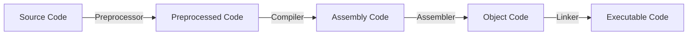

# Class 4 : Machine-Level Representation of Programs(程序的机器级表示)

---

- [1. C, Assembly and Machine Code](#1-c-assembly-and-machine-code)
    - [1.1. Program Coding](#11-program-coding)
    - [1.2. Two Important Abstraction](#12-two-important-abstraction)
        - [1.2.1. Several important concepts](#121-several-important-concepts)
        - [1.2.2. Attention](#122-attention)
- [2. Assembly Basics: Registers, operands, move](#2-assembly-basics-registers-operands-move)
    - [2.1. Registers](#21-registers)
        - [2.1.1. Addition About x86-64 Registers](#211-addition-about-x86-64-registers)
    - [2.2. Operands](#22-operands)
        - [2.2.1. Operands Types](#221-operands-types)
        - [2.2.2. Data Format](#222-data-format)
        - [2.2.3. Operand Combination(操作数组合)](#223-operand-combination操作数组合)
        - [2.2.4. Simple Memory Addressing Modes(简单内存寻址模式)](#224-simple-memory-addressing-modes简单内存寻址模式)
    - [2.3. Instruction About Data Movement(数据移动指令)](#23-instruction-about-data-movement数据移动指令)
        - [2.3.1. MOV, MOVZ, MOVS类](#231-mov-movz-movs类)
        - [2.3.2. Limitation Of Operand Combination(操作数组合的限制)](#232-limitation-of-operand-combination操作数组合的限制)
        - [2.3.3. Stack Operation(栈操作)](#233-stack-operation栈操作)
    - [2.4. Arithmetic and Logical Instructions(算术和逻辑指令)](#24-arithmetic-and-logical-instructions算术和逻辑指令)
        - [2.4.1. Load Effective Address(LEA)](#241-load-effective-addresslea)
        - [2.4.2. Unary adn Binary Operations](#242-unary-adn-binary-operations)
        - [2.4.3. Special Arithmetic Operations](#243-special-arithmetic-operations)
- [3. Assembly Upgrade : `Control` Condition Code, Jump instructions, Loop Control, Switch](#3-assembly-upgrade--control-condition-code-jump-instructions-loop-control-switch)
    - [3.1. Several Important Registers](#31-several-important-registers)
    - [3.2. Condition Code(条件码)](#32-condition-code条件码)
        - [3.2.1. Set Condition Codes](#321-set-condition-codes)
        - [3.2.2. Access condition code](#322-access-condition-code)
            - [3.2.2.1. Set by Condition](#3221-set-by-condition)
        - [3.2.3. Jump Instructions](#323-jump-instructions)
            - [Unconditional Jump](#unconditional-jump)
            - [Conditional Jump](#conditional-jump)
        - [Coding of Jump Instructions](#coding-of-jump-instructions)
        - [Condition Branches Realized by Jump Instructions](#condition-branches-realized-by-jump-instructions)
        - [Condition Branched Realized by Condition Transmission](#condition-branched-realized-by-condition-transmission)
        - [Loop](#loop)
            - [`do-while` Loop](#do-while-loop)
            - [`while` Loop](#while-loop)
            - [`for` Loop](#for-loop)
        - [`switch` Sentence](#switch-sentence)
        - [](#)

---

## 1. C, Assembly and Machine Code

### 1.1. Program Coding

We have learned about how a C program is "translated" into executable file finally  

CLI command to compile a C program(gcc):  

```bash
gcc -Og -o p p1.c p2.c ...
```

flowchart:  



1. **Preprocessor**(C预处理器)  
    Extend the source code  
    - `#include`
    - `#define`
    - etc.
2. **Compiler**(编译器)
    Translate the source code into assembly code  
    `p1.c` -> `p1.s`  
    `p2.c` -> `p2.s`  

    CLI command to generate assembly code:  

    ```bash
    gcc -S -o p.s p.c
    ```

3. **Assembler**(汇编器)  
    Translate the assembly code into object code  
    `p1.s` -> `p1.o`  
    `p2.s` -> `p2.o`  
    *P.S. Including the binary code of all orders but the address is not fixed*  
    *包含所有指令的二进制表示，但是还没有填入全局值的地址*  

    CLI command to generate object code:  

    ```bash
    gcc -c -o p.o p.s
    ```

4. **Linker**(链接器)  
    Combine the object code into an executable file  
    `p1.o` + `p2.o` -> `p`  
    *P.S. Link all the object code and functions of the library and generate the final executable file*  

    CLI command to generate executable file:  

    ```bash
    gcc -o p p1.o p2.o ...
    ```

### 1.2. Two Important Abstraction

1. **ISA(Instruction Set Architecture, 指令集架构):**  
    定义机器级程序的格式和行为  
    包括对处理器状态、指令格式、指令对状态的影响等的定义  
    Most ISA(including x86-64) describe the behavior of the program like that every instruction is executed sequentially  
    we may take it for granted that only one instruction is finished and then the next instruction is executed  
    Actually, the processor can execute multiple instructions at the same time  
    in other words, the processor can **concurrently** execute multiple instructions  
    and this gets the same result as the sequential execution  
2. **virtual memory address(虚拟内存地址):**  
    Machine-level programs use virtual memory addresses actually  
    the operating system presents the memory to programs as **a large array of bytes**  
    Memory system links multiple storage hardware and the operating system software together  

#### 1.2.1. Several important concepts  

- PC(Program Counter, 程序计数器):  
    give the next instruction's address in the memory  
- register(寄存器):  
    - integer register(整数寄存器):  
        16 named registers in x86-64, one stores 64 bits value  
        can store **address(pointer in C) or integer data**  
    - condition code register(条件码寄存器):  
        store the latest result status info of calculation or logical instruction  
    - vector register(浮点寄存器):  
        stores one or more integer or float value(s)  

#### 1.2.2. Attention

1. **Machine-level Program only recognize the memory as a very large and memory-addressed array**  
    In C program, we use a model to allocate and distribute objects of many kinds of data type  
    but in Machine Code, there is no difference, even the pointer and integer  
2. **Operating System transfer virtual memory address to the real physical address**  
3. **One Machine Instruction only perform a very basic operation**  

**Assembly Code Format**  

- ATT(AT&T)  
    We use this format in ICS class  
    and it is the default format of `gcc`, `objdump`  
- Intel

What we should know is there are here two formats of assembly code  
ATT's from: left to right  
Intel's from: right to left

ATT's instructions are like this:  

```assembly
movq %rax, %rbx
```

Intel's instructions are like this:  

```assembly
mov rbx, rax
```

---

## 2. Assembly Basics: Registers, operands, move

### 2.1. Registers

**Architecture:**  

- x86-64:  
    - 16 integer registers:  
        - `%rax`, `%rbx`, `%rcx`, `%rdx`, `%rsi`, `%rdi`, `%rsp`, `%rbp`, `%r8`, `%r9`, `%r10`, `%r11`, `%r12`, `%r13`, `%r14`, `%r15`  
        - `%rax` is the return value of the function  
        - `%rsp` is the stack pointer  
        - `%rbp` is the base pointer  
        - `%rdi`, `%rsi`, `%rdx`, `%rcx`, `%r8`, `%r9` are the first six parameters of the function  
- IA32

We mostly pay attention to x86-64 in ICS class  

#### 2.1.1. Addition About x86-64 Registers

- ax: accumulator register  
    in fact: AH&AH --> AX  
    AH: high byte of AX  
    AL: low byte of AX  
    bx, cx, dx are just the same format  
- bx: base register
- cx: counter register
- dx: data register
- si: source index register
- di: destination index register
- sp: stack pointer register
- bp: base pointer register
- r8-r15: additional registers  

### 2.2. Operands

In High Level Languages Only two types:  

- constants
- variables

For Machine Code?

#### 2.2.1. Operands Types

- **Immediate(立即数)**  
    Constant integer data  
    e.g. `$0x123` , `$-666`  

    general form:  
    `$constant`  

    Encoded with 1, 2 or 4 bytes
- **Register(寄存器)**  
    One of 16 integer registers  
    e.g. `%rax`, `%rbx`  
    *`%rsp` is reserved for special use*  

    these registers have special uses for particular instructions  
- **Memory**  
    8 consecutive bytes of memory at address given by register  
    e.g. `(%rax)`  

#### 2.2.2. Data Format

Use C's declaration as reference:  

| C declaration | Intel Data Type  | Assembly Code Suffix | Size(In bytes) |
| :-----------: | :--------------: | :------------------: | :------------: |
|     char      |       byte       |          b           |       1        |
|     short     |       word       |          w           |       2        |
|      int      |    doubleword    |          l           |       4        |
|     long      |     quadword     |          q           |       8        |
|     char*     |     quadword     |          q           |       8        |
|     float     | single precision |          s           |       4        |
|    double     | double precision |          l           |       8        |

*`char*` represents the pointer in C(for 64bits computer and system)*  

#### 2.2.3. Operand Combination(操作数组合)

| Source (Src) | Destination (Dst) | Src, Dest             | C Analog       |
| ------------ | ----------------- | --------------------- | -------------- |
| Imm          | Reg               | `movq $0x123, %rax`   | `temp = 0x123` |
| Imm          | Mem               | `movq $0x123, (%rax)` | `*p = 0x123`   |
| Reg          | Reg               | `movq %rax, %rbx`     | `temp = src`   |
| Reg          | Mem               | `movq %rax, (%rbx)`   | `*p = src`     |
| Mem          | Reg               | `movq (%rax), %rbx`   | `temp = *p`    |

*Cannot do memory-memory transfer with only a single instruction*  

#### 2.2.4. Simple Memory Addressing Modes(简单内存寻址模式)

| Type  |     Format      |        Operating Value        |     Name     |
| :---: | :-------------: | :---------------------------: | :----------: |
|  Imm  |     $\$Imm$     |             $Imm$             |  立即数寻址  |
|  Reg  |     $\%r_a$     |           $R[r_a]$            |  寄存器寻址  |
|  Mem  |      $Imm$      |           $M[Imm]$            |   绝对寻址   |
|  Mem  |     $(r_a)$     |          $M[R[r_a]]$          |   间接寻址   |
|  Mem  |   $Imm(r_b)$    |       $M[Imm + R[r_b]]$       | 基址偏移寻址 |
|  Mem  | $(r_b, r_i, s)$ | $M[R[r_b] + R[r_i] \times s]$ | 比例变址寻址 |

*s must be 1, 2, 4 or 8 !!!*  

### 2.3. Instruction About Data Movement(数据移动指令)

#### 2.3.1. MOV, MOVZ, MOVS类

**basic format**(for ATT):  

```assembly
movq Src, Dst
```

- `Src`: source operand
- `Dst`: destination operand

#### 2.3.2. Limitation Of Operand Combination(操作数组合的限制)  

Easy to understand we can move to `Imm`  
And the other limitation is that `Mem` to `Mem` is not allowed  

#### 2.3.3. Stack Operation(栈操作)

**Stack: a special kind of data structure**  
here what we talk about is in programming  
related important concepts:  

1. top  
    the top of the stack must be explicitly specified  
    (we are used to think the top increases from up to down)  
2. push  
    add element to the top of the stack  

    ```assembly
    pushq S
    ```

    `S` means the source operand  
3. pop  
    remove element from the top of the stack

    ```assembly
    popq D
    ```

    `D` means the destination operand
4. LIFO(Last In First Out)  
    the last element added to the stack is the first one to be removed  

And the stack we mentioned here is a hardware stack in x86(硬件实现)  

### 2.4. Arithmetic and Logical Instructions(算术和逻辑指令)

#### 2.4.1. Load Effective Address(LEA)

**LEA**: Load Effective Address(加载有效地址)  
calculate address and only about address  

format:  

```assembly
lea src, dest
```

its src will be treated as a memory address  
*no matter it is or not actually!*  

it can use [simple memory addressing modes](#224-simple-memory-addressing-modes简单内存寻址模式)  
we should note that it is not meaning accessing the memory  
bug just calculate the "address"  

#### 2.4.2. Unary adn Binary Operations

**Binary Operations:**  

1. add  
2. sub  
3. imul  
    imul: integer multiplication  
    integer means both positive and negative are included  
    in other word, it's multiplication of signed integer  
4. xor  
5. and  
6. or  
7. shl  
    shl: shift (logic) left  
    logic is omitted  
8. shr  
9. sal  
    sal: shift arithmetic left  
    alisa: shl  
10. sar  
    will use the sign bit to fill the empty bits in the left  

common format:  

```assembly
operation src, dest
```

this means:  
do operation between `src` and `dest`  
store the result in `dest`  

**Unary Operations:**  

1. inc  
    similar to `++`  
2. dec  
    similar to `--`  
3. neg
4. not

common format:  

```assembly
operation dest
```

#### 2.4.3. Special Arithmetic Operations

## 3. Assembly Upgrade : `Control` Condition Code, Jump instructions, Loop Control, Switch

What we talk about above is almost linear code movement  
However, the situation where the program needs to make a decision for running sequence by data test's result is very common  
And then we talk about these in machine code  

### 3.1. Several Important Registers

- `%rax` : Temporary data(many return values and intermediate values stored here)  
- `%rsp` : Pointer to the top of the stack(栈顶指针)  
    *Stack Pointer*  
- `%rip` : Location of current code control point  
    *Instruction Pointer*  
    *Attention: this register is not included in the 16 registers*  

### 3.2. Condition Code(条件码)

Except for the Integer registers  
CPU also maintains a group of special single-bit **condition code registers(条件码寄存器)**  

**Several Mostly Used Condition Code**:  

- **CF(carry flag)** 进位标志  
- **ZF(zero flag)**  零标志  
- **SF(sign flag)**  符号标志  
- **OF(overflow flag)** 溢出标志  

#### 3.2.1. Set Condition Codes

All the Arithmetic and Logical Instructions except LEA will set the condition codes  
(LEA just calculate the address)  
above these instructions implicitly set condition codes  

besides, two types of instructions will explicitly set condition codes:  

1. CMP  
2. TEST  

format:  

```asm
cmpq src1, src2

testq src1, src2
```

instruction CMP set the condition codes  
based on the result of `src2 - src1`  

and TEST set the condition codes  
based on the result of `src1 & src2`  

**Attention:**  

the sequence of the two source operands in CMP is different from what we are used to  
it reverses the two operands  
for example:  

if we want to express `a < b`  
normally we use `cmpq a, b`  
but if we use `setl` to set the condition codes  
you will get actually the result of `b < a`  
*because of the basic principle of access and using condition codes*

so if we want to directly use the `l` or `g` or `a` or `b` mentioned below  
we should reverse the two operands here  

**Addition:**  

TEST usually uses the same `src`  
in this situation, only `src` is 0, the ZF will be set to 1  
so we can judge whether the `src` is 0 or not  

#### 3.2.2. Access condition code

condition codes are usually not be accessed directly  

there are three common ways to use them:  

1. use specific combination of condition codes to set one byte to 0 or 1  
2. use condition codes to jump to somewhere in the program  
3. pass the data with condition codes  

##### 3.2.2.1. Set by Condition

SET instructions:  

1. `sete`  
    equal  
    same with `setz`
2. `setne`  
    not equal  
    same with `setnz`  
3. `sets`  
    sign  
4. `setns`  
5. `setg`  
    greater (for signed integer)  
    same with `setnle`  
6. `setge`  
    greater or equal  
    the rest are similar to this  
7. setl  
    less  
8. setle  
9. seta  
    above (for unsigned integer)  
10. setae  
11. setb  
    below (for unsigned integer)  
12. setbe  

format:  

```asm
SET Dest
```

P.S.  
Above in [Set Condition Codes](#321-set-condition-codes)  
we mentioned the sequence of the two source operands is different from what we are used to  
this is actually because of the actually way of using combination of condition codes  

| instruction | actual effect     |
| ----------- | ----------------- |
| sete        | D : ZF            |
| setne       | D : \~ZF          |
| sets        | D : SF            |
| setns       | D : \~SF          |
| setg        | D : \~(SF^OF)&~ZF |
| setge       | D : \~(SF^OF)     |
| setl        | D : SF^OF         |
| setle       | D : (SF^OF)\|ZF   |
| seta        | D : \~CF&\~ZF     |
| setae       | D : ~CF           |
| setb        | D : CF            |
| setbe       | D : CF\|ZF        |

#### 3.2.3. Jump Instructions

**jump** is used to change the executing process to a new position in the program  

**jump** instructions are so important  
that almost all the control will use them  
like `if-else`, `switch`, all the loop structures and so on  

as for wether condition is used  
there are two types of jump instructions  

1. unconditional  
2. conditional  

##### Unconditional Jump

its `jmp`  

1. directly jump  
    asm code will use `label` to denote the dest to jump to  
    usually belike: `.L1`  

    ```asm
    jmp Label
    ```

    means the process will jump to the position of `Label` to keep on the following instructions  

2. indirectly jump  

    ```asm
    jmp *Operand
    ```

    what operand is is what we know before  

##### Conditional Jump

conditional jump only allows jump to specific label  

the way we choose the condition is just the same with SET instructions  

#### Coding of Jump Instructions

this is what we should actually pay attention to  

actually, there are several ways to code jump instruction  
the mostly used one is PC-relative(PC相对的)  
that is to say, use the difference between dest instruction address and the following instruction address after jump instruction  

and the second coding method is to provide the absolute address  

#### Condition Branches Realized by Jump Instructions

#### Condition Branched Realized by Condition Transmission

#### Loop

##### `do-while` Loop

##### `while` Loop

##### `for` Loop

#### `switch` Sentence

important concept: **jump table**  

####