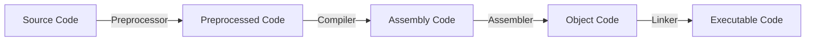

# Class 4 : Machine-Level Representation of Programs(程序的机器级表示)

---

## C, Assembly and Machine Code

### Program Coding

We have learned about how a C program is "translated" into executable file finally  

CLI command to compile a C program(gcc):  

```bash
gcc -Og -o p p1.c p2.c ...
```

flowchart:  



1. **Preprocessor**(C预处理器)  
    Extend the source code  
    - `#include`
    - `#define`
    - etc.
2. **Compiler**(编译器)
    Translate the source code into assembly code  
    `p1.c` -> `p1.s`  
    `p2.c` -> `p2.s`  

    CLI command to generate assembly code:  

    ```bash
    gcc -S -o p.s p.c
    ```

3. **Assembler**(汇编器)  
    Translate the assembly code into object code  
    `p1.s` -> `p1.o`  
    `p2.s` -> `p2.o`  
    *P.S. Including the binary code of all orders but the address is not fixed*  
    *包含所有指令的二进制表示，但是还没有填入全局值的地址*  

    CLI command to generate object code:  

    ```bash
    gcc -c -o p.o p.s
    ```

4. **Linker**(链接器)  
    Combine the object code into an executable file  
    `p1.o` + `p2.o` -> `p`  
    *P.S. Link all the object code and functions of the library and generate the final executable file*  

    CLI command to generate executable file:  

    ```bash
    gcc -o p p1.o p2.o ...
    ```
