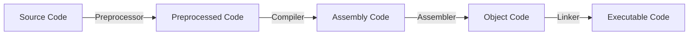

# Class 4 : Machine-Level Representation of Programs(程序的机器级表示)

---

- [1. C, Assembly and Machine Code](#1-c-assembly-and-machine-code)
    - [1.1. Program Coding](#11-program-coding)
    - [1.2. Two Important Abstraction](#12-two-important-abstraction)
        - [1.2.1. Several important concepts](#121-several-important-concepts)
        - [1.2.2. Attention](#122-attention)
- [2. Assembly Basics: Registers, operands, move](#2-assembly-basics-registers-operands-move)
    - [2.1. Registers](#21-registers)
        - [2.1.1. Addition About x86-64 Registers](#211-addition-about-x86-64-registers)
    - [2.2. Operands](#22-operands)
        - [2.2.1. Operands Types](#221-operands-types)
        - [2.2.2. Data Format](#222-data-format)
        - [2.2.3. Operand Combination(操作数组合)](#223-operand-combination操作数组合)
        - [2.2.4. Simple Memory Addressing Modes(简单内存寻址模式)](#224-simple-memory-addressing-modes简单内存寻址模式)
    - [2.3. Instruction About Data Movement(数据移动指令)](#23-instruction-about-data-movement数据移动指令)
        - [2.3.1. MOV, MOVZ, MOVS类](#231-mov-movz-movs类)
        - [2.3.2. Limitation Of Operand Combination(操作数组合的限制)](#232-limitation-of-operand-combination操作数组合的限制)
        - [2.3.3. Stack Operation(栈操作)](#233-stack-operation栈操作)
    - [2.4. Arithmetic and Logical Instructions(算术和逻辑指令)](#24-arithmetic-and-logical-instructions算术和逻辑指令)
        - [2.4.1. Load Effective Address(LEA)](#241-load-effective-addresslea)
        - [2.4.2. Unary adn Binary Operations](#242-unary-adn-binary-operations)
        - [2.4.3. Special Arithmetic Operations](#243-special-arithmetic-operations)
- [3. Assembly Upgrade : `Control` Condition Code, Jump instructions, Loop Control, Switch](#3-assembly-upgrade--control-condition-code-jump-instructions-loop-control-switch)
    - [3.1. Several Important Registers](#31-several-important-registers)
    - [3.2. Condition Code(条件码)](#32-condition-code条件码)
        - [3.2.1. Set Condition Codes](#321-set-condition-codes)
        - [3.2.2. Access condition code](#322-access-condition-code)
            - [3.2.2.1. Set by Condition](#3221-set-by-condition)
        - [3.2.3. Jump Instructions](#323-jump-instructions)
            - [3.2.3.1. Unconditional Jump](#3231-unconditional-jump)
            - [3.2.3.2. Conditional Jump](#3232-conditional-jump)
        - [3.2.4. Coding of Jump Instructions](#324-coding-of-jump-instructions)
        - [3.2.5. Condition Branches Realized by Jump Instructions](#325-condition-branches-realized-by-jump-instructions)
        - [3.2.6. Condition Branched Realized by Condition Transmission](#326-condition-branched-realized-by-condition-transmission)
        - [3.2.7. Loop](#327-loop)
            - [3.2.7.1. `do-while` Loop](#3271-do-while-loop)
            - [3.2.7.2. `while` Loop](#3272-while-loop)
            - [3.2.7.3. `for` Loop](#3273-for-loop)
        - [3.2.8. `switch` Sentence](#328-switch-sentence)
    - [3.3. Procedure(过程)](#33-procedure过程)
        - [3.3.1. Runtime Stack(运行时栈)](#331-runtime-stack运行时栈)
            - [3.3.1.1. Stack Frame](#3311-stack-frame)
        - [3.3.2. Transfer Control(转移控制)](#332-transfer-control转移控制)
            - [3.3.2.1. What Happens When Invoking a Procedure And Returning From It?](#3321-what-happens-when-invoking-a-procedure-and-returning-from-it)
        - [3.3.3. Transfer Data(数据传送)](#333-transfer-data数据传送)
        - [3.3.4. Local Storage on the Stack(栈上的局部存储)](#334-local-storage-on-the-stack栈上的局部存储)
            - [3.3.4.1. Common Situations](#3341-common-situations)
        - [3.3.5. Space of Local Storage in the Registers(寄存器中的局部存储空间)](#335-space-of-local-storage-in-the-registers寄存器中的局部存储空间)
        - [3.3.6. Recursive Procedures(递归过程)](#336-recursive-procedures递归过程)
    - [3.4. Array Allocate and Access(数组分配和访问)](#34-array-allocate-and-access数组分配和访问)
        - [3.4.1. Basic Principles(基本原则)](#341-basic-principles基本原则)
        - [3.4.2. Pointer Arithmetic(指针计算)](#342-pointer-arithmetic指针计算)
        - [3.4.3. Nested Array(嵌套数组)](#343-nested-array嵌套数组)
        - [3.4.4. Fixed-Size Array(定长数组)](#344-fixed-size-array定长数组)
        - [3.4.5. Variable-Size Array(变长数组)](#345-variable-size-array变长数组)
    - [3.5. Heterogeneous Data Structures(异质的数据结构)](#35-heterogeneous-data-structures异质的数据结构)
        - [3.5.1. Struct](#351-struct)
            - [Accessing Members in Struct](#accessing-members-in-struct)
        - [3.5.2. Union](#352-union)
        - [3.5.3. Data Alignment(数据对齐)](#353-data-alignment数据对齐)
    - [Combine the Data and Control in Machine-Level Program](#combine-the-data-and-control-in-machine-level-program)
        - [Understand Pointer](#understand-pointer)
        - [Introduction to the Usage of GDB](#introduction-to-the-usage-of-gdb)
        - [Out-of-Bounds Memory References and Buffer Overflow(内存越界引用和缓冲区溢出)](#out-of-bounds-memory-references-and-buffer-overflow内存越界引用和缓冲区溢出)

---

## 1. C, Assembly and Machine Code

### 1.1. Program Coding

We have learned about how a C program is "translated" into executable file finally  

CLI command to compile a C program(gcc):  

```bash
gcc -Og -o p p1.c p2.c ...
```

flowchart:  



1. **Preprocessor**(C预处理器)  
    Extend the source code  
    - `#include`
    - `#define`
    - etc.
2. **Compiler**(编译器)
    Translate the source code into assembly code  
    `p1.c` -> `p1.s`  
    `p2.c` -> `p2.s`  

    CLI command to generate assembly code:  

    ```bash
    gcc -S -o p.s p.c
    ```

3. **Assembler**(汇编器)  
    Translate the assembly code into object code  
    `p1.s` -> `p1.o`  
    `p2.s` -> `p2.o`  
    *P.S. Including the binary code of all orders but the address is not fixed*  
    *包含所有指令的二进制表示，但是还没有填入全局值的地址*  

    CLI command to generate object code:  

    ```bash
    gcc -c -o p.o p.s
    ```

4. **Linker**(链接器)  
    Combine the object code into an executable file  
    `p1.o` + `p2.o` -> `p`  
    *P.S. Link all the object code and functions of the library and generate the final executable file*  

    CLI command to generate executable file:  

    ```bash
    gcc -o p p1.o p2.o ...
    ```

### 1.2. Two Important Abstraction

1. **ISA(Instruction Set Architecture, 指令集架构):**  
    定义机器级程序的格式和行为  
    包括对处理器状态、指令格式、指令对状态的影响等的定义  
    Most ISA(including x86-64) describe the behavior of the program like that every instruction is executed sequentially  
    we may take it for granted that only one instruction is finished and then the next instruction is executed  
    Actually, the processor can execute multiple instructions at the same time  
    in other words, the processor can **concurrently** execute multiple instructions  
    and this gets the same result as the sequential execution  
2. **virtual memory address(虚拟内存地址):**  
    Machine-level programs use virtual memory addresses actually  
    the operating system presents the memory to programs as **a large array of bytes**  
    Memory system links multiple storage hardware and the operating system software together  

#### 1.2.1. Several important concepts  

- PC(Program Counter, 程序计数器):  
    give the next instruction's address in the memory  
- register(寄存器):  
    - integer register(整数寄存器):  
        16 named registers in x86-64, one stores 64 bits value  
        can store **address(pointer in C) or integer data**  
    - condition code register(条件码寄存器):  
        store the latest result status info of calculation or logical instruction  
    - vector register(浮点寄存器):  
        stores one or more integer or float value(s)  

#### 1.2.2. Attention

1. **Machine-level Program only recognize the memory as a very large and memory-addressed array**  
    In C program, we use a model to allocate and distribute objects of many kinds of data type  
    but in Machine Code, there is no difference, even the pointer and integer  
2. **Operating System transfer virtual memory address to the real physical address**  
3. **One Machine Instruction only perform a very basic operation**  

**Assembly Code Format**  

- ATT(AT&T)  
    We use this format in ICS class  
    and it is the default format of `gcc`, `objdump`  
- Intel

What we should know is there are here two formats of assembly code  
ATT's from: left to right  
Intel's from: right to left

ATT's instructions are like this:  

```assembly
movq %rax, %rbx
```

Intel's instructions are like this:  

```assembly
mov rbx, rax
```

---

## 2. Assembly Basics: Registers, operands, move

### 2.1. Registers

**Architecture:**  

- x86-64:  
    - 16 integer registers:  
        - `%rax`, `%rbx`, `%rcx`, `%rdx`, `%rsi`, `%rdi`, `%rsp`, `%rbp`, `%r8`, `%r9`, `%r10`, `%r11`, `%r12`, `%r13`, `%r14`, `%r15`  
        - `%rax` is the return value of the function  
        - `%rsp` is the stack pointer  
        - `%rbp` is the base pointer  
        - `%rdi`, `%rsi`, `%rdx`, `%rcx`, `%r8`, `%r9` are the first six parameters of the function  
- IA32

We mostly pay attention to x86-64 in ICS class  

#### 2.1.1. Addition About x86-64 Registers

- ax: accumulator register  
    in fact: AH&AH --> AX  
    AH: high byte of AX  
    AL: low byte of AX  
    bx, cx, dx are just the same format  
- bx: base register
- cx: counter register
- dx: data register
- si: source index register
- di: destination index register
- sp: stack pointer register
- bp: base pointer register
- r8-r15: additional registers  

### 2.2. Operands

In High Level Languages Only two types:  

- constants
- variables

For Machine Code?

#### 2.2.1. Operands Types

- **Immediate(立即数)**  
    Constant integer data  
    e.g. `$0x123` , `$-666`  

    general form:  
    `$constant`  

    Encoded with 1, 2 or 4 bytes
- **Register(寄存器)**  
    One of 16 integer registers  
    e.g. `%rax`, `%rbx`  
    *`%rsp` is reserved for special use*  

    these registers have special uses for particular instructions  
- **Memory**  
    8 consecutive bytes of memory at address given by register  
    e.g. `(%rax)`  

#### 2.2.2. Data Format

Use C's declaration as reference:  

| C declaration | Intel Data Type  | Assembly Code Suffix | Size(In bytes) |
| :-----------: | :--------------: | :------------------: | :------------: |
|     char      |       byte       |          b           |       1        |
|     short     |       word       |          w           |       2        |
|      int      |    doubleword    |          l           |       4        |
|     long      |     quadword     |          q           |       8        |
|     char*     |     quadword     |          q           |       8        |
|     float     | single precision |          s           |       4        |
|    double     | double precision |          l           |       8        |

*`char*` represents the pointer in C(for 64bits computer and system)*  

#### 2.2.3. Operand Combination(操作数组合)

| Source (Src) | Destination (Dst) | Src, Dest             | C Analog       |
| ------------ | ----------------- | --------------------- | -------------- |
| Imm          | Reg               | `movq $0x123, %rax`   | `temp = 0x123` |
| Imm          | Mem               | `movq $0x123, (%rax)` | `*p = 0x123`   |
| Reg          | Reg               | `movq %rax, %rbx`     | `temp = src`   |
| Reg          | Mem               | `movq %rax, (%rbx)`   | `*p = src`     |
| Mem          | Reg               | `movq (%rax), %rbx`   | `temp = *p`    |

*Cannot do memory-memory transfer with only a single instruction*  

#### 2.2.4. Simple Memory Addressing Modes(简单内存寻址模式)

| Type  |     Format      |        Operating Value        |     Name     |
| :---: | :-------------: | :---------------------------: | :----------: |
|  Imm  |     $\$Imm$     |             $Imm$             |  立即数寻址  |
|  Reg  |     $\%r_a$     |           $R[r_a]$            |  寄存器寻址  |
|  Mem  |      $Imm$      |           $M[Imm]$            |   绝对寻址   |
|  Mem  |     $(r_a)$     |          $M[R[r_a]]$          |   间接寻址   |
|  Mem  |   $Imm(r_b)$    |       $M[Imm + R[r_b]]$       | 基址偏移寻址 |
|  Mem  | $(r_b, r_i, s)$ | $M[R[r_b] + R[r_i] \times s]$ | 比例变址寻址 |

*s must be 1, 2, 4 or 8 !!!*  

### 2.3. Instruction About Data Movement(数据移动指令)

#### 2.3.1. MOV, MOVZ, MOVS类

**basic format**(for ATT):  

```assembly
movq Src, Dst
```

- `Src`: source operand
- `Dst`: destination operand

#### 2.3.2. Limitation Of Operand Combination(操作数组合的限制)  

Easy to understand we can move to `Imm`  
And the other limitation is that `Mem` to `Mem` is not allowed  

#### 2.3.3. Stack Operation(栈操作)

**Stack: a special kind of data structure**  
here what we talk about is in programming  
related important concepts:  

1. top  
    the top of the stack must be explicitly specified  
    (we are used to think the top increases from up to down)  
2. push  
    add element to the top of the stack  

    ```assembly
    pushq S
    ```

    `S` means the source operand  
3. pop  
    remove element from the top of the stack

    ```assembly
    popq D
    ```

    `D` means the destination operand
4. LIFO(Last In First Out)  
    the last element added to the stack is the first one to be removed  

And the stack we mentioned here is a hardware stack in x86(硬件实现)  

### 2.4. Arithmetic and Logical Instructions(算术和逻辑指令)

#### 2.4.1. Load Effective Address(LEA)

**LEA**: Load Effective Address(加载有效地址)  
calculate address and only about address  

format:  

```assembly
lea src, dest
```

its src will be treated as a memory address  
*no matter it is or not actually!*  

it can use [simple memory addressing modes](#224-simple-memory-addressing-modes简单内存寻址模式)  
we should note that it is not meaning accessing the memory  
bug just calculate the "address"  

#### 2.4.2. Unary adn Binary Operations

**Binary Operations:**  

1. add  
2. sub  
3. imul  
    imul: integer multiplication  
    integer means both positive and negative are included  
    in other word, it's multiplication of signed integer  
4. xor  
5. and  
6. or  
7. shl  
    shl: shift (logic) left  
    logic is omitted  
8. shr  
9. sal  
    sal: shift arithmetic left  
    alisa: shl  
10. sar  
    will use the sign bit to fill the empty bits in the left  

common format:  

```assembly
operation src, dest
```

this means:  
do operation between `src` and `dest`  
store the result in `dest`  

**Unary Operations:**  

1. inc  
    similar to `++`  
2. dec  
    similar to `--`  
3. neg
4. not

common format:  

```assembly
operation dest
```

#### 2.4.3. Special Arithmetic Operations

## 3. Assembly Upgrade : `Control` Condition Code, Jump instructions, Loop Control, Switch

What we talk about above is almost linear code movement  
However, the situation where the program needs to make a decision for running sequence by data test's result is very common  
And then we talk about these in machine code  

### 3.1. Several Important Registers

- `%rax` : Temporary data(many return values and intermediate values stored here)  
- `%rsp` : Pointer to the top of the stack(栈顶指针)  
    *Stack Pointer*  
- `%rip` : Location of current code control point  
    *Instruction Pointer*  
    *Attention: this register is not included in the 16 registers*  

### 3.2. Condition Code(条件码)

Except for the Integer registers  
CPU also maintains a group of special single-bit **condition code registers(条件码寄存器)**  

**Several Mostly Used Condition Code**:  

- **CF(carry flag)** 进位标志  
- **ZF(zero flag)**  零标志  
- **SF(sign flag)**  符号标志  
- **OF(overflow flag)** 溢出标志  

#### 3.2.1. Set Condition Codes

All the Arithmetic and Logical Instructions except LEA will set the condition codes  
(LEA just calculate the address)  
above these instructions implicitly set condition codes  

besides, two types of instructions will explicitly set condition codes:  

1. CMP  
2. TEST  

format:  

```asm
cmpq src1, src2

testq src1, src2
```

instruction CMP set the condition codes  
based on the result of `src2 - src1`  

and TEST set the condition codes  
based on the result of `src1 & src2`  

**Attention:**  

the sequence of the two source operands in CMP is different from what we are used to  
it reverses the two operands  
for example:  

if we want to express `a < b`  
normally we use `cmpq a, b`  
but if we use `setl` to set the condition codes  
you will get actually the result of `b < a`  
*because of the basic principle of access and using condition codes*

so if we want to directly use the `l` or `g` or `a` or `b` mentioned below  
we should reverse the two operands here  

**Addition:**  

TEST usually uses the same `src`  
in this situation, only `src` is 0, the ZF will be set to 1  
so we can judge whether the `src` is 0 or not  

#### 3.2.2. Access condition code

condition codes are usually not be accessed directly  

there are three common ways to use them:  

1. use specific combination of condition codes to set one byte to 0 or 1  
2. use condition codes to jump to somewhere in the program  
3. pass the data with condition codes  

##### 3.2.2.1. Set by Condition

SET instructions:  

1. `sete`  
    equal  
    same with `setz`
2. `setne`  
    not equal  
    same with `setnz`  
3. `sets`  
    sign  
4. `setns`  
5. `setg`  
    greater (for signed integer)  
    same with `setnle`  
6. `setge`  
    greater or equal  
    the rest are similar to this  
7. setl  
    less  
8. setle  
9. seta  
    above (for unsigned integer)  
10. setae  
11. setb  
    below (for unsigned integer)  
12. setbe  

format:  

```asm
SET Dest
```

P.S.  
Above in [Set Condition Codes](#321-set-condition-codes)  
we mentioned the sequence of the two source operands is different from what we are used to  
this is actually because of the actually way of using combination of condition codes  

| instruction | actual effect     |
| ----------- | ----------------- |
| sete        | D : ZF            |
| setne       | D : \~ZF          |
| sets        | D : SF            |
| setns       | D : \~SF          |
| setg        | D : \~(SF^OF)&~ZF |
| setge       | D : \~(SF^OF)     |
| setl        | D : SF^OF         |
| setle       | D : (SF^OF)\|ZF   |
| seta        | D : \~CF&\~ZF     |
| setae       | D : ~CF           |
| setb        | D : CF            |
| setbe       | D : CF\|ZF        |

#### 3.2.3. Jump Instructions

**jump** is used to change the executing process to a new position in the program  

**jump** instructions are so important  
that almost all the control will use them  
like `if-else`, `switch`, all the loop structures and so on  

as for wether condition is used  
there are two types of jump instructions  

1. unconditional  
2. conditional  

##### 3.2.3.1. Unconditional Jump

its `jmp`  

1. directly jump  
    asm code will use `label` to denote the dest to jump to  
    usually belike: `.L1`  

    ```asm
    jmp Label
    ```

    means the process will jump to the position of `Label` to keep on the following instructions  

2. indirectly jump  

    ```asm
    jmp *Operand
    ```

    what operand is is what we know before  

##### 3.2.3.2. Conditional Jump

conditional jump only allows jump to specific label  

the way we choose the condition is just the same with SET instructions  

#### 3.2.4. Coding of Jump Instructions

this is what we should actually pay attention to  

actually, there are several ways to code jump instruction  
the mostly used one is PC-relative(PC相对的)  
that is to say, use the difference between dest instruction address and the following instruction address after jump instruction  

and the second coding method is to provide the absolute address  

#### 3.2.5. Condition Branches Realized by Jump Instructions

#### 3.2.6. Condition Branched Realized by Condition Transmission

#### 3.2.7. Loop

##### 3.2.7.1. `do-while` Loop

##### 3.2.7.2. `while` Loop

##### 3.2.7.3. `for` Loop

#### 3.2.8. `switch` Sentence

important concept: **jump table**  

### 3.3. Procedure(过程)

**procedure** is a very important kind of abstract software  
it provides a way to encapsulate(封装) the code  
just leaves some specific interface(params) and a optional return value  

A well designed program should make good use of procedures  
hides the implementation details  
while providing a clear interface  
that is to say  
make it easy to understand what are needed to use the  procedures and what they will do  

it may have different forms in different programming languages  
like `function`, `method`, `subroutine`, and so on  

firstly,
here we care about here is the shared characteristics of them  

to implement the concept of procedure in machine level  
here are some important attributes to handle:  

1. **transfer control**(传递控制)  
2. **transfer data**(传递数据)  
3. **assign and free memory**(分配和释放内存)  

here we will talk about these mechanisms one by one  

#### 3.3.1. Runtime Stack(运行时栈)

Stack structure provides the LIFO principle of memory management  
witch plays a crucial role in the invocation of procedures  
*(actually in many other language, it is the same)*  

stack grows from high address to low address  
when procedure `P` invokes procedure `Q`  
`P` and all the procedure in the invoking chain will be suspended(挂起)  
*(we can just regard this as we don't pay attention to these temporary)*  
and we just need to pay attention to the procedure `Q` right now  
it can allocate new spaces for local variables or another procedures  
when we finished `Q`, we can just releases the space of it and return to `P`  

and we can stare in the stack to find what it is doing right now  
just as what we have mentioned ([here](#233-stack-operation栈操作))  
we just to move the pointer to the top of the stack to manage the stack  
more clearly, we can say:  
we sub specific value from `%rsp` to allocate space for the procedure  
and add specific value to `%rsp` to free the space  

##### 3.3.1.1. Stack Frame

after this, we should know another important concept:  
**stack frame**(栈帧)  

in a word, it's the space allocated for a procedure in the stack  

not all procedures have their own stack frame  
if all the local variables can be stored in the registers  
and no other procedures are invoked  
then the stack frame is not needed  

#### 3.3.2. Transfer Control(转移控制)

when the program transfers control  
what it actually do is to set PC(程序计数器)  

to invoke a procedure and return from it  
we use `call` and `ret` instruction respectively  

| instruction   | description                               |
| :------------ | :---------------------------------------- |
| call Label    | invoke procedure                          |
| call *Operand | invoke procedure                          |
| ret           | return from the running invoked procedure |

*just like jump, we can call the procedure directly or indirectly*  

*if we use objdump, we can see `callq` and `retq`, its just the same*  
*it means it's x86-64 but not IA32*  

##### 3.3.2.1. What Happens When Invoking a Procedure And Returning From It?

we now may wonder how do the two instructions work  
first, they work very closely with stack  

`call`: remember the address of the current procedure(caller) and jump to the invoked procedure(callee)  
more clearly, it will:  

1. push the address of the next instruction after `call`(for example, `A`) onto the stack  
2. change the `%rip` to the address of the invoked procedure  

after the callee is finished, we need to return to the caller  
so we first free the space of the callee in the stack  
and then:  

1. pop `A` from the stack  
2. change the `%rip` to `A`  

so we have finished a invoking of the procedure  

#### 3.3.3. Transfer Data(数据传送)

usually, the things we need transfer are not only the control  
but also the data(or we usually say the parameters and return values)  
here we talk about how data was transfer when we invoke a procedure  

**Transfer Data Mechanism**:  

1. mostly through registers  
2. if 1. not enough, use stack  

when using registers, six values are supported normally  
and there is a specific order to use them:  

1. `DI`(destination index)
2. `SI`(source index)
3. `DX`(data register)
4. `CX`(counter register)
5. `R8`(additional register)
6. `R9`(additional register)

the specific space in each register is up to the data type  
the name we don't mentioned here  

when the number is over 6  
we have to use stack  

more specifically, the compiler will do like this:  

1. store the first 6 parameters in the registers  
2. store the 7~nth parameters in the stack  
    *normally the 1. happens before 2.*  

*Attention: the parameters themselves also have the order when put into rigisters*  
*from the last to the first*  
*and the 7~nth parameters are also the same in the stack*  
*that is to say, 7th parameter will be on the top of stack before `call`*  

little test are as follows:  

[TransferParams.c](../4_TestCode/10_Week10/Stack/TransferParams.c)  
[TransferParams.asm](../4_TestCode/10_Week10/Stack/TransferParams.asm)  

*P.S. above is the way gcc under OS linux will do*  
*Windows may attempt to use `DX` and `CX` first*  

#### 3.3.4. Local Storage on the Stack(栈上的局部存储)

Many easy procedures don't need these  
but how do we know?  
and when it happens, what it will do?  

##### 3.3.4.1. Common Situations

1. registers are not enough  
2. need to the address of some variables  
3. variables contains arrays or structures  
    *we need to use address to access there things*  

all in all  
when registers are not enough or we need stable address  
the storage on the stack is needed  

#### 3.3.5. Space of Local Storage in the Registers(寄存器中的局部存储空间)

We can now see that no matter what the procedure is running  
they all share the same registers  
*(although only one is running at a time)*  

so how we make sure the value in the registers will not change as the way we don't expect?  
x86-64 provides the unified practice to use the registers for all procedures  

as a result, the registers are divided into two types:  

1. **callee saved**(被调用者保存)  
    `%rbx`, `%rbp`, `%r12~15`  
2. **caller saved**(调用者保存)  
    except callee saved registers and `%rsp`  
    `%rax`, `%rcx`, `%rdx`, `%rsi`, `%rdi`, `%r8~11`  

callee saved and caller saved mechanism limited  
the way how the value in different registers should be saved and used  

callee saved registers:  
the callee should make sure the values in these registers are the same  
as they were when the callee was invoked  

caller saved registers:  
caller are responsible for saving proper values in these registers  
before invoking the callee  
in other word, callee can use these registers freely  
so caller takes the responsibility to save the values in these registers  

#### 3.3.6. Recursive Procedures(递归过程)

### 3.4. Array Allocate and Access(数组分配和访问)

#### 3.4.1. Basic Principles(基本原则)

in C, we know that the array is actually a linear consecutive value list  
it is allocated a continuous space in the memory  

each element's address in the array have a strong linear relationship  
[simple address calculation](#224-simple-memory-addressing-modes简单内存寻址模式) can be used to simplify the array access  

for example, we want to get the value in the `i`th element in array `int A[]`  
we can do like this:  

```asm
movl (%rdx,%rcx,4), %eax
```

- `%rdx` : denotes the address of `A` here  
- `%rcx` : denotes the index of the element(`i`) here  

#### 3.4.2. Pointer Arithmetic(指针计算)

as we all know, too  
C allows us to operate some calculations on pointers  

suppose that we have a pointer `p` pointing to the type `T`  
and the byte size of `T` is `L`  

then if we say `p+i`  
what we actually do is belike:  
`p_value` + `i * L`  

what's we should pay much attention to is what we are calculating!  
the **value** or the **address**?  

for `int` we use long word and usually use `movl` to get the value  
and for `address` we use quad word and usually use `leaq` to calculate the address  

*P.S. when we try to get the difference between pointers, the result has the type `long`*  

#### 3.4.3. Nested Array(嵌套数组)

Nested array(or multi-dimensional array) is a special case of array  
the basic principles also establish  

usually we can use multiple LEA instructions to get the address used to find the element  
e.g. calculate `&A[i][j]`(type `int`)  

```asm
# A in %rdi, i in %rsi, j in %rdx
leaq (%rsi,%rsi,2), %rax # compute 3i
leaq (%rdi,%rax,4), %rax # compute A + 12i
movl (%rax,%rdx,4), %eax # get M[A + 12i + 4j]
```

#### 3.4.4. Fixed-Size Array(定长数组)

Fixed-size array:  
fixed-size means that the array's size is fixed at compile time  
*it's a good habit to use `#define CONST_NUM number` and then use the `CONST_NUM` as some fixed number*  
*as when we need to modify the number, we just need to do the modification here one time*  

it's performance can be optimized by the compiler  

- [ ] example required here  

#### 3.4.5. Variable-Size Array(变长数组)

ISO C99 introduced a very important feature:  
variable-size array is supported  
*(at past, programmers have to use malloc or calloc to allocate space for these arrays)*  

Variable-size means that the array's dimension can be calculated until runtime  
so if we want to compiler the way to get the address of the element in the array  
we may need to do this in another way:  

e.g. get `A[i][j]` in the array `int A[n][n]`, in witch `n` is a variable  

```asm
# n in %rdi, A in %rsi, i in %rdx, j in %rcx`
imulq %rdx, %rdi # compute n*i
leaq (%rsi,%rdi,4), %rax # compute A + 4*n*i
movl (%rax,%rcx,4), %eax # get M[A + 4*n*i + 4*j]
```

different from [fixed Nested Array](#343-nested-array嵌套数组)  
we using `imulq` to calculate the address of `A[i]`  
`imulq` may cost a lot time more then `leaq`  

### 3.5. Heterogeneous Data Structures(异质的数据结构)

Heterogeneous(异质的) means：[introduction](https://www.merriam-webster.com/dictionary/heterogeneous)  
here it means the data structures combining different types together  

C provides two mechanisms:  

- structure  
    using `struct`  
    putting different types together in a unit  
- union  
    using `union`  
    allowing using several different types to refer to the same object  

#### 3.5.1. Struct

in one structure(for example `s`)  
all the components are put in a continuous space in memory  
the pointer to the `s` is pointing to the first byte of `s`  

##### Accessing Members in Struct

compiler will maintain every type of the `struct`  
remember the bias bytes of every component(`filed`)  
so we can refer to the components in the `struct`  

e.g.  

```c
struct s {
    int i;
    int j;
    int a[2];
    int *p;
}
```

the start address:  

| field  | start byte(`s` as 0) |
| ------ | --------------------- |
| `i`    | 0                     |
| `j`    | 4                     |
| `a[0]` | 8                     |
| `a[1]` | 12                    |
| `p`    | 16                    |

we can know each `s` will take 24 bytes space  

and we have the pointer `sp` pointing to `struct s*`  
here we do something:  

1. copy `i` to `j`  

    ```asm
    # sp in %rdi
    movl (%rdi), %eax # get i
    movl %eax, 4(%rdi) # copy i to j
    ```

2. get `a[i]` with `i` = 1  

    ```asm
    # sp in %rdi, i in %rsi
    leaq 8(%rdi,%rsi,4), %rax # compute A + 8 + 4*i
    ```

    8 means the space occupied by `i` and `j`  

**Summary:**  

compiler will maintain the offset of each field in the struct  
and the access to the field will be resolved in compile time  
the machine code will not include any declaration or name info of the fields  
all we can see is the presentation in the bias form  

#### 3.5.2. Union

the declaration of `union` is very similar to `struct`  
but it means using different types to refer to the same block of memory  

just similar to the example above, we have `union` `u`:  

```c
union u {
    int i;
    int j;
    int a[2];
    int *p;
}
```

all the fields will start at byte 0  
*we can just imaging we have one block of memory, we use union declaration to represent that we can translate this using different data types*  

and each instance of `u` takes the biggest one of the fields' size  
here it is 8 bytes  

#### 3.5.3. Data Alignment(数据对齐)

Why we need to do data alignment?  
in a word, to improve the performance of the memory system  
*some computer system limit the legal addresses of the basic data types*  
*they must be the multiple of specific value(usually 2, 4 or 8)*  

| K   | type                |
| --- | ------------------- |
| 1   | char                |
| 2   | short               |
| 4   | int, float          |
| 8   | long, double, char* |

When all the instances of every types satisfy their alignment  
then we can make sure the alignment is satisfied  

- [ ] TODO what here means?  

Compiler will using `.align` to denote the alignment global data should satisfy  

How do compiler implements data alignment?  
if the code includes `struct`  
compiler may fill some empty bytes in or after the fields in the `struct` to implement the alignment  

e.g.  

```c
struct s {
    int i ;
    char c ;
    int j;
}
```

the start byte:  

| field | start byte |
| ----- | ---------- |
| i     | 0          |
| c     | 4          |
| j     | 8          |

yes, we can find that `j` dose not start from 5 but actually from 8  
it's because the compiler insert some empty after `c` to make sure `j` starts from the multiple of 4  
*besides, the start address of `s` must be the multiple of 4 at first*  

### Combine the Data and Control in Machine-Level Program

right now, we have talked about two parts:  

1. how machine-level program be controlled  
2. how different data structures are implemented  

in this section, we'll try to figure out  
how data and control interact  

#### Understand Pointer

#### Introduction to the Usage of GDB

#### Out-of-Bounds Memory References and Buffer Overflow(内存越界引用和缓冲区溢出)

