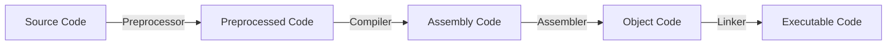

# Class 4 : Machine-Level Representation of Programs(程序的机器级表示)

---

- [1. C, Assembly and Machine Code](#1-c-assembly-and-machine-code)
    - [1.1. Program Coding](#11-program-coding)
    - [1.2. Two Important Abstraction](#12-two-important-abstraction)
        - [1.2.1. Several important concepts](#121-several-important-concepts)
        - [1.2.2. Attention](#122-attention)
- [2. Assembly Basics: Registers, operands, move](#2-assembly-basics-registers-operands-move)
    - [2.1. Registers](#21-registers)
    - [2.2. Operands](#22-operands)
        - [2.2.1. Operands Types](#221-operands-types)
        - [2.2.2. Data Format](#222-data-format)
        - [2.2.3. Operand Combination(操作数组合)](#223-operand-combination操作数组合)
        - [2.2.4. Simple Memory Addressing Modes(简单内存寻址模式)](#224-simple-memory-addressing-modes简单内存寻址模式)
    - [2.3. Move Instruction(移动指令)](#23-move-instruction移动指令)
        - [Limitation Of Operand Combination(操作数组合的限制)](#limitation-of-operand-combination操作数组合的限制)
        - [Other Operation of Move Instruction](#other-operation-of-move-instruction)
        - [Stack Operation(栈操作)](#stack-operation栈操作)
- [Assembly Upgrade : Condition Code, Jump instructions, Loop Control, Switch](#assembly-upgrade--condition-code-jump-instructions-loop-control-switch)
    - [Condition Code(条件码)](#condition-code条件码)
        - [Operand Combination(操作数组合)](#operand-combination操作数组合)
        - [Simple Memory Addressing Modes(简单内存寻址模式)](#simple-memory-addressing-modes简单内存寻址模式)

---

## 1. C, Assembly and Machine Code

### 1.1. Program Coding

We have learned about how a C program is "translated" into executable file finally  

CLI command to compile a C program(gcc):  

```bash
gcc -Og -o p p1.c p2.c ...
```

flowchart:  



1. **Preprocessor**(C预处理器)  
    Extend the source code  
    - `#include`
    - `#define`
    - etc.
2. **Compiler**(编译器)
    Translate the source code into assembly code  
    `p1.c` -> `p1.s`  
    `p2.c` -> `p2.s`  

    CLI command to generate assembly code:  

    ```bash
    gcc -S -o p.s p.c
    ```

3. **Assembler**(汇编器)  
    Translate the assembly code into object code  
    `p1.s` -> `p1.o`  
    `p2.s` -> `p2.o`  
    *P.S. Including the binary code of all orders but the address is not fixed*  
    *包含所有指令的二进制表示，但是还没有填入全局值的地址*  

    CLI command to generate object code:  

    ```bash
    gcc -c -o p.o p.s
    ```

4. **Linker**(链接器)  
    Combine the object code into an executable file  
    `p1.o` + `p2.o` -> `p`  
    *P.S. Link all the object code and functions of the library and generate the final executable file*  

    CLI command to generate executable file:  

    ```bash
    gcc -o p p1.o p2.o ...
    ```

### 1.2. Two Important Abstraction

1. **ISA(Instruction Set Architecture, 指令集架构):**  
    定义机器级程序的格式和行为  
    包括对处理器状态、指令格式、指令对状态的影响等的定义  
    Most ISA(including x86-64) describe the behavior of the program like that every instruction is executed sequentially  
    we may take it for granted that only one instruction is finished and then the next instruction is executed  
    Actually, the processor can execute multiple instructions at the same time  
    in other words, the processor can **concurrently** execute multiple instructions  
    and this gets the same result as the sequential execution  
2. **virtual memory address(虚拟内存地址):**  
    Machine-level programs use virtual memory addresses actually  
    the operating system presents the memory to programs as **a large array of bytes**  
    Memory system links multiple storage hardware and the operating system software together  

#### 1.2.1. Several important concepts  

- PC(Program Counter, 程序计数器):  
    give the next instruction's address in the memory  
- register(寄存器):  
    - integer register(整数寄存器):  
        16 named registers in x86-64, one stores 64 bits value  
        can store **address(pointer in C) or integer data**  
    - condition code register(条件码寄存器):  
        store the latest result status info of calculation or logical instruction  
    - vector register(浮点寄存器):  
        stores one or more integer or float value(s)  

#### 1.2.2. Attention

1. **Machine-level Program only recognize the memory as a very large and memory-addressed array**  
    In C program, we use a model to allocate and distribute objects of many kinds of data type  
    but in Machine Code, there is no difference, even the pointer and integer  
2. **Operating System transfer virtual memory address to the real physical address**  
3. **One Machine Instruction only perform a very basic operation**  

**Assembly Code Format**  

- ATT(AT&T)  
    We use this format in ICS class  
    and it is the default format of `gcc`, `objdump`  
- Intel

What we should know is there are here two formats of assembly code  
ATT's from: left to right  
Intel's from: right to left

ATT's instructions are like this:  

```assembly
movq %rax, %rbx
```

Intel's instructions are like this:  

```assembly
mov rbx, rax
```

---

## 2. Assembly Basics: Registers, operands, move

### 2.1. Registers

**Architecture:**  

- x86-64:  
    - 16 integer registers:  
        - `%rax`, `%rbx`, `%rcx`, `%rdx`, `%rsi`, `%rdi`, `%rsp`, `%rbp`, `%r8`, `%r9`, `%r10`, `%r11`, `%r12`, `%r13`, `%r14`, `%r15`  
        - `%rax` is the return value of the function  
        - `%rsp` is the stack pointer  
        - `%rbp` is the base pointer  
        - `%rdi`, `%rsi`, `%rdx`, `%rcx`, `%r8`, `%r9` are the first six parameters of the function  
- IA32

We mostly pay attention to x86-64 in ICS class  

### 2.2. Operands

In High Level Languages Only two types:  

- constants
- variables

For Machine Code?

#### 2.2.1. Operands Types

- **Immediate(立即数)**  
    Constant integer data  
    e.g. `$0x123` , `$-666`  

    general form:  
    `$constant`  

    Encoded with 1, 2 or 4 bytes
- **Register(寄存器)**  
    One of 16 integer registers  
    e.g. `%rax`, `%rbx`  
    *`%rsp` is reserved for special use*  

    these registers have special uses for particular instructions  
- **Memory**  
    8 consecutive bytes of memory at address given by register  
    e.g. `(%rax)`  

#### 2.2.2. Data Format

Use C's declaration as reference:  

| C declaration | Intel Data Type  | Assembly Code Suffix | Size(In bytes) |
| :-----------: | :--------------: | :------------------: | :------------: |
|     char      |       byte       |          b           |       1        |
|     short     |       word       |          w           |       2        |
|      int      |    doubleword    |          l           |       4        |
|     long      |     quadword     |          q           |       8        |
|     char*     |     quadword     |          q           |       8        |
|     float     | single precision |          s           |       4        |
|    double     | double precision |          l           |       8        |

*`char*` represents the pointer in C(for 64bits computer and system)*  

#### 2.2.3. Operand Combination(操作数组合)

| Source (Src) | Destination (Dst) | Src, Dest             | C Analog       |
| ------------ | ----------------- | --------------------- | -------------- |
| Imm          | Reg               | `movq $0x123, %rax`   | `temp = 0x123` |
| Imm          | Mem               | `movq $0x123, (%rax)` | `*p = 0x123`   |
| Reg          | Reg               | `movq %rax, %rbx`     | `temp = src`   |
| Reg          | Mem               | `movq %rax, (%rbx)`   | `*p = src`     |
| Mem          | Reg               | `movq (%rax), %rbx`   | `temp = *p`    |

*Cannot do memory-memory transfer with only a single instruction*  

#### 2.2.4. Simple Memory Addressing Modes(简单内存寻址模式)

| Type  |     Format      |        Operating Value        |     Name     |
| :---: | :-------------: | :---------------------------: | :----------: |
|  Imm  |     $\$Imm$     |             $Imm$             |  立即数寻址  |
|  Reg  |     $\%r_a$     |           $R[r_a]$            |  寄存器寻址  |
|  Mem  |      $Imm$      |           $M[Imm]$            |   绝对寻址   |
|  Mem  |     $(r_a)$     |          $M[R[r_a]]$          |   间接寻址   |
|  Mem  |   $Imm(r_b)$    |       $M[Imm + R[r_b]]$       | 基址偏移寻址 |
|  Mem  | $(r_b, r_i, s)$ | $M[R[r_b] + R[r_i] \times s]$ | 比例变址寻址 |

*s must be 1, 2, 4 or 8 !!!*  

### 2.3. Move Instruction(移动指令)

**basic format**(for ATT):  

```assembly
movq Src, Dst
```

- `Src`: source operand
- `Dst`: destination operand

#### Limitation Of Operand Combination(操作数组合的限制)  

Easy to understand we can move to `Imm`  
And the other limitation is that `Mem` to `Mem` is not allowed  

#### Other Operation of Move Instruction


#### Stack Operation(栈操作)

**Stack: a special kind of data structure**  
here what we talk about is in programming  
related important concepts:  

1. top  
    the top of the stack must be explicitly specified  
    (we are used to think the top increases from up to down)  
2. push  
    add element to the top of the stack  
3. pop  
    remove element from the top of the stack
4. LIFO(Last In First Out)  
    the last element added to the stack is the first one to be removed  

And the stack we mentioned here is a hardware stack in x86(硬件实现)  

## Assembly Upgrade : Condition Code, Jump instructions, Loop Control, Switch

### Condition Code(条件码)

What we talk about above is almost linear code movement  
However, the situation where the program needs to make a decision for running sequence by data test's result is very common  

And **Condition Code** is designed for this purpose  
Condition code provides two basic low-level 机制
 #### Operand Combination(操作数组合)

| Source (Src) | Destination (Dst) | Src, Dest                          |C Analog|
|--------------|--------------------|----------------------------------|--------|
| Imm          | Reg                | `movq $0x123, %rax`              | `temp = 0x123` |
| Imm          | Mem                | `movq $0x123, (%rax)`            | `*p = 0x123` |
| Reg          | Reg                | `movq %rax, %rbx`                | `temp = src` |
| Reg          | Mem                | `movq %rax, (%rbx)`              | `*p = src` |
| Mem          | Reg                | `movq (%rax), %rbx`              | `temp = *p` |

*Cannot do memory-memory transfer with only a single instruction*  

#### Simple Memory Addressing Modes(简单内存寻址模式)
