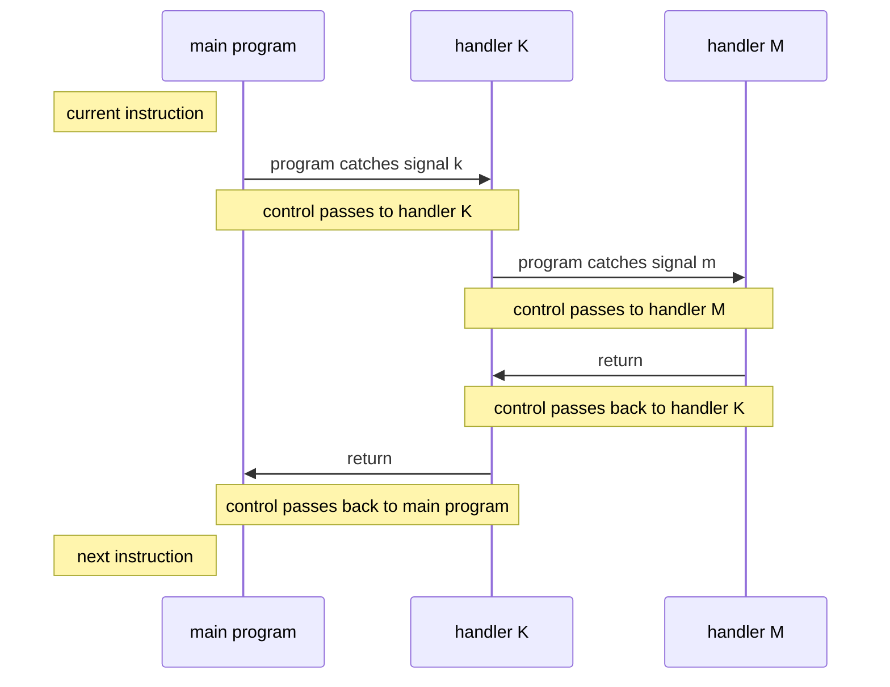

# Class 10 : Exception Control Flow

---

- [1. Exceptions(异常)](#1-exceptions异常)
    - [1.1. Exception Handling(异常处理)](#11-exception-handling异常处理)
    - [1.2. Types of Exceptions(异常类型)](#12-types-of-exceptions异常类型)
        - [1.2.1. Interrupt(中断)](#121-interrupt中断)
        - [1.2.2. Trap(陷阱) and System Call(系统调用)](#122-trap陷阱-and-system-call系统调用)
        - [1.2.3. Fault(故障)](#123-fault故障)
        - [1.2.4. Abort(终止)](#124-abort终止)
    - [1.3. Exceptions In Linux/x86-64 System](#13-exceptions-in-linuxx86-64-system)
        - [1.3.1. Example of Fault and Abort](#131-example-of-fault-and-abort)
        - [1.3.2. System Call](#132-system-call)
- [2. Process(进程)](#2-process进程)
    - [2.1. Logic Control Flow(逻辑控制流)](#21-logic-control-flow逻辑控制流)
    - [2.2. Concurrent Flow(并发流)](#22-concurrent-flow并发流)
    - [2.3. Private Address Space(私有地址空间)](#23-private-address-space私有地址空间)
    - [2.4. User Mode and Kernel Mode(用户模式和内核模式)](#24-user-mode-and-kernel-mode用户模式和内核模式)
    - [2.5. Context Switch(上下文切换)](#25-context-switch上下文切换)
- [3. Error Handling Invoked by OS(系统调用错误处理)](#3-error-handling-invoked-by-os系统调用错误处理)
- [4. Process Control(进程控制)](#4-process-control进程控制)
    - [4.1. Get Process ID](#41-get-process-id)
    - [4.2. Create and Terminate Process](#42-create-and-terminate-process)
        - [4.2.1. `exit`](#421-exit)
        - [4.2.2. `fork`](#422-fork)
        - [4.2.3. `waitpid`](#423-waitpid)
        - [4.2.4. `sleep` and `pause`](#424-sleep-and-pause)
        - [4.2.5. `execve`](#425-execve)
    - [4.3. Use `fork` and `execve` to Run Program](#43-use-fork-and-execve-to-run-program)
        - [4.3.1. Shell](#431-shell)
- [5. Signal](#5-signal)
    - [5.1. Signal Terminology](#51-signal-terminology)
        - [5.1.1. pending signal](#511-pending-signal)
        - [5.1.2. blocked signal](#512-blocked-signal)
        - [5.1.3. Simple Understanding](#513-simple-understanding)
    - [5.2. Send Signal](#52-send-signal)
        - [5.2.1. Process Group](#521-process-group)
        - [5.2.2. Use `/bin/kill` to Send Signal](#522-use-binkill-to-send-signal)
        - [5.2.3. Send Signals Using Keyboard](#523-send-signals-using-keyboard)
        - [5.2.4. Use `kill` Function to Send Signal](#524-use-kill-function-to-send-signal)
        - [5.2.5. Use `alarm` Function to Send Signal](#525-use-alarm-function-to-send-signal)
    - [5.3. Receive Signal](#53-receive-signal)
        - [5.3.1. What is Receiving a Signal?](#531-what-is-receiving-a-signal)
        - [5.3.2. Signal Handlers](#532-signal-handlers)
    - [5.4. Block and Unblock Signals](#54-block-and-unblock-signals)
    - [5.5. Write Signal Handler](#55-write-signal-handler)
        - [5.5.1. Safe Signal Handling](#551-safe-signal-handling)
        - [5.5.2. Correct Signal Handling](#552-correct-signal-handling)
        - [5.5.3. Portable Signal Handling](#553-portable-signal-handling)
    - [5.6. Synchronizing Flows to Avoid Nasty Concurrency Bugs](#56-synchronizing-flows-to-avoid-nasty-concurrency-bugs)
    - [5.7. Explicitly Waiting for Signals](#57-explicitly-waiting-for-signals)
- [6. Nonlocal Jumps](#6-nonlocal-jumps)

---

## 1. Exceptions(异常)

### 1.1. Exception Handling(异常处理)

### 1.2. Types of Exceptions(异常类型)

- **interrupt(中断)**  
- **trap(陷阱)**  
- **fault(故障)**  
- **abort(终止)**  

#### 1.2.1. Interrupt(中断)

#### 1.2.2. Trap(陷阱) and System Call(系统调用)

#### 1.2.3. Fault(故障)

#### 1.2.4. Abort(终止)

### 1.3. Exceptions In Linux/x86-64 System

#### 1.3.1. Example of Fault and Abort

#### 1.3.2. System Call

## 2. Process(进程)

Process is one of the most profound and successful concepts in CS  

**context(上下文)**  

### 2.1. Logic Control Flow(逻辑控制流)

one time one process  

### 2.2. Concurrent Flow(并发流)

multi flows are executed at the same time  
this phenomenon is called **concurrency(并发)**  

the concept one and other processes are executed sequentially  
is called **multitasking(多任务)**  

**time slice(时间片)**  
**time slicing(时间分片)**  

understand **parallel flow** and **concurrent flow**  
they are different  

### 2.3. Private Address Space(私有地址空间)

### 2.4. User Mode and Kernel Mode(用户模式和内核模式)

the concept of mode is to strict the privilege of  
executing instructions and accessible address space range  

by default, the process works in **user mode(用户模式)**  

**privileged instruction(特权指令)** is not allowed in user mode  

### 2.5. Context Switch(上下文切换)

A higher-level exception control flow  
which is used to realize the multitasking by OS kernel  

every process has its own **context**  
witch is the status to restart the preempted process  

**scheduling(调度)**  
**scheduler(调度器)**  

## 3. Error Handling Invoked by OS(系统调用错误处理)

## 4. Process Control(进程控制)

A lot of System Calls in C program are provided by UNIX  
here we are going to introduce some of them  

### 4.1. Get Process ID

every process has its own ID(PID)  
witch is a positive number  

we can use `getpid` to get the PID of the process witch uses this function(for convenience, we call it caller)  
and `getppid` to get the PID of caller's parent process  
they return the type `pid_t`
*`pid_t` is actually `int` in `type.h`*  

we introduce these functions by add head file `sys/types.h` and `unistd.h`  

### 4.2. Create and Terminate Process

We can regard that a process is always in one status of the three types below:  

1. running  
    the process is executed on CPU  
    or waits to be executed  
    and eventually it will be scheduled by kernel  
2. stopped  
    the process execution is suspended(挂起) and will not be scheduled  

    process will stop when receiving signals:  
    SIGSTOP, SIGTSTP, SIGTTIN or SIGTTOU  
    and it will be running again when it receives SIGCONT  

3. terminated  
    the process stops, forever  

    for three reasons:  
    1. receive a signal which means terminating the process  
    2. return from main program  
    3. `exit` function is called  

#### 4.2.1. `exit`

as mentioned above, it is a function to terminate a process  

we will use head file `stdlib.h`  

```c
#include <stdlib.h>

void exit(int status)
```

`exit` function uses `status` exit status to terminate the process  
*another way is to return a int type value in main program*  

#### 4.2.2. `fork`

it's a function used by parent process to create a new running subprocess  
with a return value in the `pid_t` type  

```c
#include <sys/types.h>
#include <unistd.h>

pid_t fork(void)
```

the child process(`cp`) is almost the same with its parent process(`pp`)  
it gets a copy of virtual memory address space(at user level and independent from `pp`'s) from `pp`  
and can open any files opened in `pp`  
the biggest difference is that they have different PIDs  

`fork` is very interesting but confusing:  
it is called once but returns twice  

- [ ] more details to be added here

#### 4.2.3. `waitpid`

to wait subprocesses in many ways  

#### 4.2.4. `sleep` and `pause`

`sleep()` suspend a process for a specific period of time  
it accepts a param of type `unsigned int` meaning the number of seconds to sleep  
if it normally returns, it returns 0  
else it returns the left time(secs) to sleep  
*this may happen when a signal is received*  

#### 4.2.5. `execve`

load and run program  

```c
#include <unistd.h>

int execve(const char *filename, const char *argv[], const char *envp[] ) ;
```

- `filename` : exe object file  
- `argv` : arg list  
- `envp` : environment variables list

only when error happens it will return to caller program  

unlike `fork`(called once, returns twice)  
it is called once and doesn't return  

### 4.3. Use `fork` and `execve` to Run Program

Unix shell and Web server uses many `fork` and `execve` to run programs  

#### 4.3.1. Shell

shell is an interactive application-level program  
which runs other programs on behalf of the user  

includes: `sh`(the earliest shell)  
and `csh` `tcsh` `ksh` `bash` and so on  

what it dose:  
execute a series of read/evaluate steps  
and then terminates  

so how it works:  

1. read a command line  
2. parse the command line  
3. run the program  

*if the command line is available*  

the cmd may be tailed by `&`  
which means the program will be run in background(bg)  
*foreground(fg) is the default*  

and it contains some `builtin_commands`  
which will first be checked by shell  
it contains some basic cmds like: `cd` `exit` `pwd` `jobs` `fg` and so on

but the simple shell is vulnerable  
as it doesn't reaped its background processes  
to solve this problem, we need signals  

## 5. Signal

to this position  
we have learned ECF at hardware and software level  
and OS level  

now we learn a higher level exception at the form of software  
it is called Linux **signal**  
which allows processes and kernel to interrupt other processes  

**A signal is a small message**  
which can notifies a process the occurrence of an event of some type in the system  

**signal types:**  
every signal belongs to a specific type  
and every types corresponds to a specific system event  
Linux supports 30 types of signals  

### 5.1. Signal Terminology

two procedures to transit a signal to the destination process:  

- [ ] TODO: add details here  

1. send signal  
    how ?  
    when ?  
2. receive signal  
    means what?  
    *it actually contains the implicit statement that the signal has been handled*  

#### 5.1.1. pending signal

the signal which has been sent but not yet received  

**pending signal is not queued**  
it means that every signal type can only have one pending signal  

that is to say, if the signal type A of a process has a pending signal  
the following signal A sent to this process will be discarded  

#### 5.1.2. blocked signal

a process can choose to block some types of signals  
and it can also unblock them  

when a signal type is blocked  
it can still be sent but will never be received  

#### 5.1.3. Simple Understanding

in fact  
kernel will maintain a set pending signals for each process  
in the bit vector `pending`  

and the blocked signals  
in the bit vector `blocked`  
which is also called `signal mask`  

when sending a signal of the type `k`  
kernel will set the `k`th bit of the `pending`  

when a process receives a signal of the type `k`  
then the `k`th bit of the `pending` will be cleared by kernel  

### 5.2. Send Signal

Unix provides a lot of mechanisms to send signals to processes  
witch is all based on the concept **process group**(进程组)  

#### 5.2.1. Process Group

every process is belonging to one and only one process group  
which is identified by a positive integer called **process group ID**(进程组ID)  

several important functions:  

- `getpgrp` returns the process group ID of the calling process  

- `setpgid`  
    receives two parameters: pid(specify the process) and pgid(specify the process group)  
    if pid is 0, it means the calling process  
    if pgid is 0, it uses the same pgid as the pid  
    *so a process's pgid can be its own pid*  

#### 5.2.2. Use `/bin/kill` to Send Signal

`/bin/kill` is a built in command in shell  

we can use it to send signals to processes  
*actually it's not very accurately like what it sounds like(just kill a program)*  

we can use `-L` to list all the signals:  

```txt
❯ /bin/kill -L
 1 HUP      2 INT      3 QUIT     4 ILL      5 TRAP     6 ABRT     7 BUS
 8 FPE      9 KILL    10 USR1    11 SEGV    12 USR2    13 PIPE    14 ALRM
15 TERM    16 STKFLT  17 CHLD    18 CONT    19 STOP    20 TSTP    21 TTIN
22 TTOU    23 URG     24 XCPU    25 XFSZ    26 VTALRM  27 PROF    28 WINCH
29 POLL    30 PWR     31 SYS
```

we can use the cmd as follows:  

```bash
/bin/kill -s <signal> <pid>
```

or

```bash
/bin/kill -<signal> <pid>
```

can send a signal(of the type in \<signal\>) to a process(of the pid in \<pid\>)  
the \<signal\> can be a number or a name listed above  

and \<pid\> can be prefixed with `-`  
meaning that the signal will be sent to all processes in the process group  

#### 5.2.3. Send Signals Using Keyboard

Unix shell use the abstraction **job(作业)**  
to represent a process created by evaluating a command line  

easy to understand:  
there always are max 1 fg job and 0-many bg jobs  

so if we type the cmd line:  

```bash
ls | sort
```

the shell will create a job consists of two processes  
which are connected by a Unix pipe  
shell will crate a independent pg for a job  
which owns the pgid usually taken from the one of the parent processes in the job  

- [ ] TODO: ? what is a Unix pipe?  

other normal signals:  

- `SIGINT`(Ctrl-C)  
    terminating the fg pg  
- `SIGTSTP`(Ctrl-Z)
    suspending the fg pg  

#### 5.2.4. Use `kill` Function to Send Signal

`kill()` is included in `signal.h`  
accepting two parameters:  

1. `pid`  
    the destination process ID  
    if it is 0, it means the processes in the calling process group
    if it is `-pid`, it means the processes in the process group with the ID of `pid`
2. `sig`  
    the signal type to be sent  
    usually use macros defined in `signal.h`  

#### 5.2.5. Use `alarm` Function to Send Signal

`alarm()` is included in `unistd.h`  

process can use it to send a `SIGALRM` signal to itself  

it accepts a parameter of type `secs`(unsigned int)  
with the meaning of the number of seconds to wait  

it also has a return value:  
new invocation of `alarm` will cancel the previous one(called pending alarm)  
and return the number of seconds left to wait  
if there is no pending alarm, it returns 0  

### 5.3. Receive Signal

- [ ] kernel and user modes are still not clear

when kernel switch process `p` from kernel mode to user mode  
it will check the unblocked pending signals of `p`  
*(unblocked pending signals : `pending & ~blocked`)*  

if it is empty, the control passes to the next instruction of `p`  
else, the first(means the smallest) signal in the unblocked pending signals will be received by `p`  
*the reception is forced and unstoppable*  

#### 5.3.1. What is Receiving a Signal?

Receiving a signal means `P` will take some actions  
when the actions are finished, control passes to the next instruction of `p`  

every signal type has a default action  
which in one of the following four:  

- terminate process  
- terminate process and core dump  
- suspend process and wait for `SIGCONT` signal to continue  
- ignore the signal  

we said these are default actions  
so we means it may be changed by the process  

#### 5.3.2. Signal Handlers

we can use `signal` function to change the default action of a signal  
it is included in `signal.h`  
and has the following prototype:  

```c
sighandler_t signal(int signum, sighandler_t handler);
```

- `signum` : the signal type to be changed  
- `handler` : the new action to be taken  
    - `SIG_IGN` : ignore the signal  
    - `SIG_DFL` : use the default action  
    - `handler` : a pointer to a function witch will be called when the signal is received  
        - the function should have the following prototype:  

            ```c
            void handler(int signum);
            ```

            which can be pointed by `sighandler_t`  

            ```c
            typedef void (*sighandler_t)(int);
            ```

**attention: the default action of `SIGSTOP` and `SIGKILL` can't be modified**  

and the signal handling can be nested  
but there is a limitation:  
one signal type's handler can only be called once  
*(in other words, the handler can not be recursive)*  

for example:  

if a signal type `k` is received  
and the handler for `k` is called  
then the signal type `k` will be blocked  
until the handler for `k` is finished  

but it may be interrupted by other signals  
like another signal type `m`  
and the handler for `m` will be called  

then the flow is belike:  



### 5.4. Block and Unblock Signals

implicit block mechanism:  
the signal witch is under handling is blocked by the kernel  

explicit block mechanism:  
we can use `sigprocmask` and some other functions to specifically block or unblock signals  

- [ ] TODO:

### 5.5. Write Signal Handler

this is actually a very complicated problem  

handlers have some properties, which make them hard to write and analyze:  

1. handlers share the same global variables with the main program  
    this may cause interference between the main program and other handlers  
2. the rule about how and when receive a signal may be confusing  
3. different systems may have different implementations of signal handling  

so we talk about some basic rules  
to write a safe, correct and portable signal handler:  

- [ ] TODO:  

#### 5.5.1. Safe Signal Handling

Guidelines:  

G0: Keep handlers as simple as possible  
G1: Call only async-signal-safe functions in handlers  
G2: Save and restore errno on entry and exit  
G3: Protect accesses to shared data structures by temporarily blocking all signals  
G4: Declare global variables as `volatile`  
    make sure they will never be stored in registers  
G5: Declare global flags as `volatile sig_atomic_t`  
    system guarantees that reads and writes to it will be atomic  
    which means the action is uninterruptible  

#### 5.5.2. Correct Signal Handling

the most important one property of signal is:  
**signal is not queued!**  

and another important one is:  
**process may run at an arbitrary order**  

this may be very confusing  

the thing we should remember is:  
don't attempt use signal to count events in other processes  
don't attempt to suppose the order of processes  
don't attempt to suppose the time consumption of processes  

what we can control is when to handle the signal  
because we can block signals  

so we should take any possible point  
that may be interrupted by a signal  

#### 5.5.3. Portable Signal Handling

`sigaction`  

`Signal` wrapper function  

### 5.6. Synchronizing Flows to Avoid Nasty Concurrency Bugs

race  
which may come from the fact that  
the subprocess may not strictly run after the parent process  

### 5.7. Explicitly Waiting for Signals

`sigsuspend` can be used to wait for a signal  
it accepts a parameter of type `sigset_t`  
denoting the blocked signals  

it is like a unstoppable version of following code:  

```c
sigprocmask(SIG_BLOCK, &mask, &prev);
pause();
sigprocmask(SIG_SETMASK, &prev, NULL);
```

## 6. Nonlocal Jumps

C provides a user level ECF form  
called **nonlocal jump**(非本地跳转)  

nonlocal jump let control directly pass  
from one function to another executing function  
without normally call-return sequence  

we use `setjmp` and `longjmp` to implement it  
