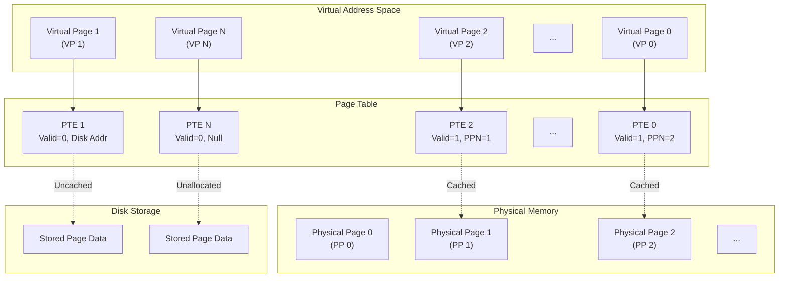
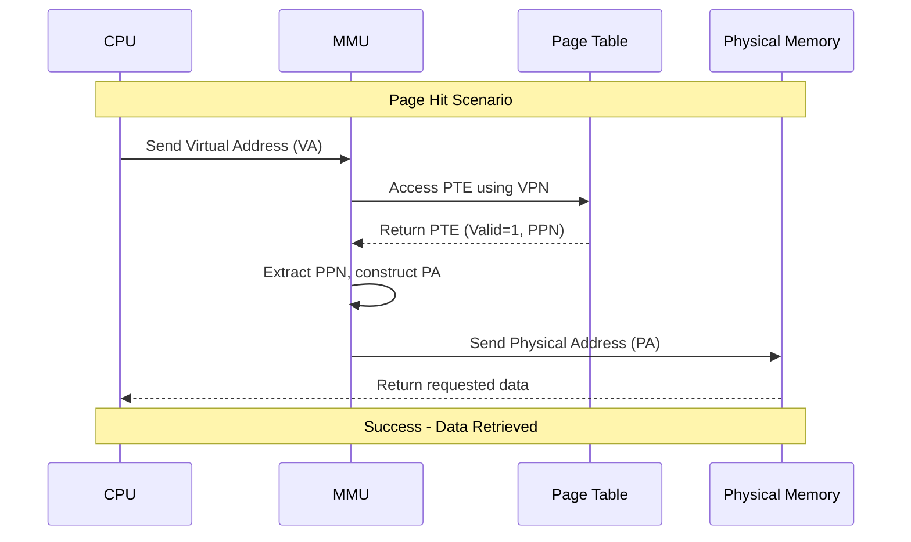
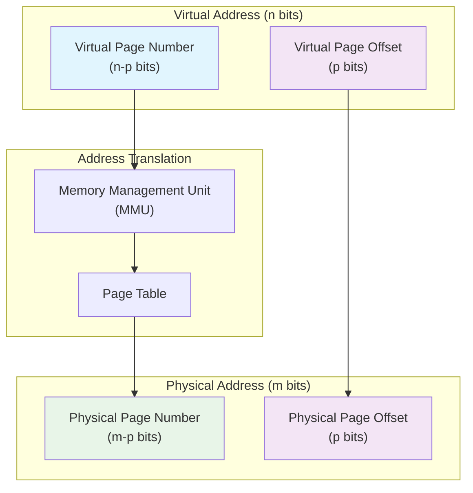
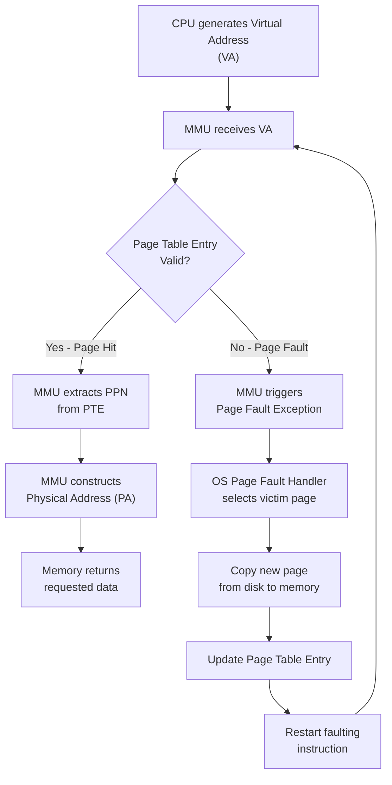
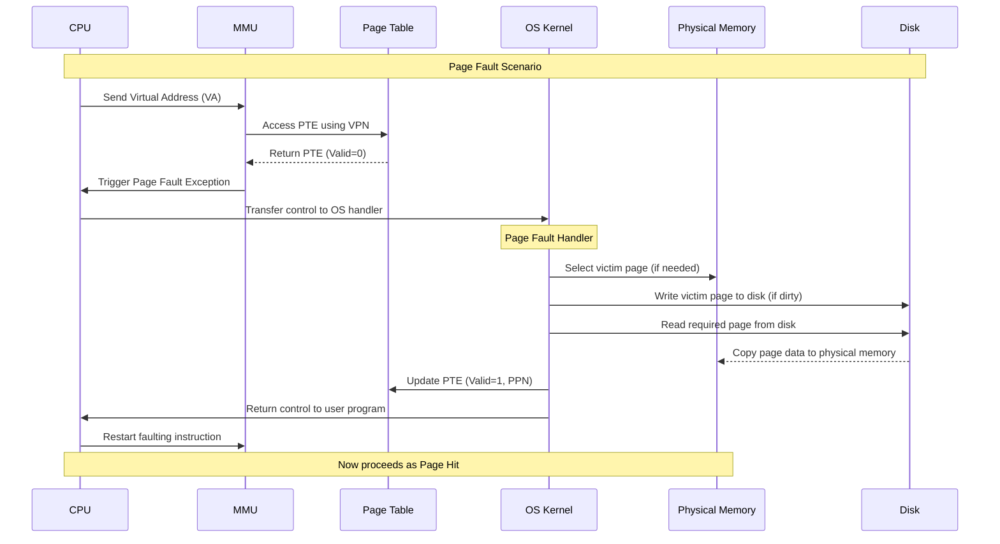
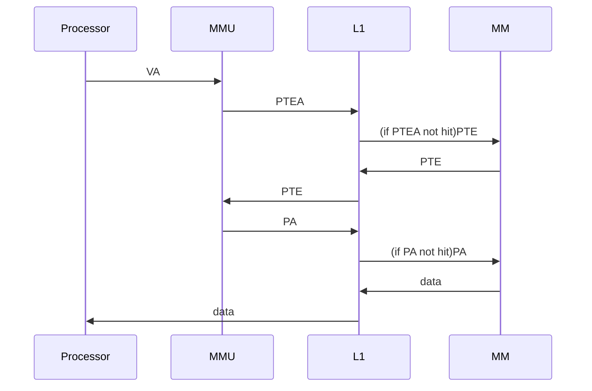

# Class 14 : Virtual Memory

**VM(Virtual Memory)** is an abstraction of the main memory  
provided by the OS to the user  

it can provide an enormous, consistent and private address space to each process  
this is very meaningful  

three crucial abilities:  

1. treat the main memory as a cache of some address space on the disk  
    make fully use of the disk space  
2. provide a consistent view of the address space to each process  
    significantly simplify the memory management  
3. protect the address space of each process from being broken by other processes  

all in all  
VM is one of the most important concepts of computer system  
and one of the most important reason for this is:  
**it works silently all the time**  
in other words  
we as the user need to pay no attention to it  
and it can just work well!  

then why we need to learn it?  
several reasons:  

1. VM is central  
    it almost pervades everywhere in the system  
    so we should learn it to better understand the system  
2. VM is powerful  
    it provides great power to the programs  
    understanding it can help us better use it's power in programming  
3. VM is dangerous  
    every time the program uses some var, a pointer or `malloc` and so on  
    it interacts with the VM  
    if the interaction is not wrong, it may cause some serious problems  
    like segmentation fault, protection fault and even just get the wrong result without any information  
    so we need to learn it to avoid these problems  

here, we'll first learn about how VM works  
and how to use and manage it in our programs  

---

- [1. Physical and Virtual Addressing(物理和虚拟寻址)](#1-physical-and-virtual-addressing物理和虚拟寻址)
    - [1.1. Physical Addressing(物理寻址)](#11-physical-addressing物理寻址)
    - [1.2. Virtual Addressing(虚拟寻址)](#12-virtual-addressing虚拟寻址)
- [2. Address Space(地址空间)](#2-address-space地址空间)
- [3. VM as a Tool for Caching](#3-vm-as-a-tool-for-caching)
    - [3.1. DRAM Cache Hierarchy](#31-dram-cache-hierarchy)
    - [3.2. Page Table(页表)](#32-page-table页表)
    - [3.3. PT(页表)](#33-pt页表)
        - [3.3.1. PTE(页表条目)](#331-pte页表条目)
        - [3.3.2. Working Principles](#332-working-principles)
    - [3.4. Page Hits(页命中)](#34-page-hits页命中)
    - [3.5. Page Faults(缺页)](#35-page-faults缺页)
    - [3.6. Allocating Page](#36-allocating-page)
    - [3.7. Locality Rescue](#37-locality-rescue)
- [4. VM as a Tool for Memory Management](#4-vm-as-a-tool-for-memory-management)
    - [4.1. Advantages](#41-advantages)
- [5. VM as a Tool for Memory Protection](#5-vm-as-a-tool-for-memory-protection)
    - [5.1. Better Access Control Through PTE](#51-better-access-control-through-pte)
- [6. Address Translation(地址翻译)](#6-address-translation地址翻译)
    - [6.1. Some Concepts](#61-some-concepts)
    - [6.2. MMU Realizes Mapping With PT](#62-mmu-realizes-mapping-with-pt)
    - [6.3. Combining Cache and VM](#63-combining-cache-and-vm)
    - [6.4. Exploiting TLB to Speed Up Address Translation](#64-exploiting-tlb-to-speed-up-address-translation)
    - [6.5. Multilevel Page Table](#65-multilevel-page-table)
        - [6.5.1. Why We Need Multilevel PT](#651-why-we-need-multilevel-pt)
        - [6.5.2. Example](#652-example)
        - [6.5.3. Work Principle](#653-work-principle)

---

## 1. Physical and Virtual Addressing(物理和虚拟寻址)

the main memory in the CS is organized as a linear array  
composed of M contiguous byte units  

every byte has a unique address, called  
**physical address(PA, 物理地址)**  

### 1.1. Physical Addressing(物理寻址)

when we think about the memory,

we may naturally think up the easiest way  
how the CPU access the memory:  
use the PA to access the data it needs in the memory  

this way is called  
**physical addressing(物理寻址)**  

when the CPU needs to access a data,  
it generates a PA and send it to the memory  
then the memory returns the data needed to the CPU  

early PC and some special systems use this way  
modern processors use another way:  
**virtual addressing(虚拟寻址)**  

### 1.2. Virtual Addressing(虚拟寻址)

in this way,  
CPU generates a **virtual address(VA)** to access the main memory  
which will by converted to the corresponding PA before sent to the memory  

this conversion is called  
**address translation(地址翻译)**  
it needs the tight cooperation between the hardware and the OS  

**MMU(Memory Management Unit)** is very important in this process  
the MMU is a special hardware unit in the CPU chip  
it makes use of the retrieving table in the memory to dynamically translate the VA to PA  
and the table is managed by the OS  

## 2. Address Space(地址空间)

address space, the set of addresses  
consisting of a contiguous set of non-negative integers  

if the integers in the address space is contiguous  
we call the address space **linear**  
and here we suppose the address space used below is linear  

just like PA and VA  
the address spaces can be virtual or physical  

modern OS usually supports 32-bits or 64-bits virtual address space  

we should clearly distinguish the data object(byte) from their property(address)  
don's get mixed up!  

## 3. VM as a Tool for Caching

we have mentioned above that  
VM is organized as a linear array  
consists of N contiguous byte units stores in the disk  

every byte has a unique VP as the reference to the array  
the content in the array can be cached in the main memory  

disk(lower level)'s data is cut into fixed-size blocks  
which is the unit to be transferred between the disk and the main memory(higher level)  
and this block is called  
**page(页)**  

in virtual memory, it's **VP(virtual page)**  
with the fixed size of $P = 2^p$  
*it's usually 4KB in modern system*  

and in the physical memory, it's **PP(physical page)**  
with the same size as the VP  
*it's also called page frame*  

at any time, the VP's set can be divided into three disjoint subsets:  

1. unallocated  
    the pages haven't been allocated(or created) by the VM system  
    in other words, it's not associated with any data  
    so it of course doesn't occupy any space in the disk  
2. cached  
    the pages have been allocated and already cached in the main memory  
3. uncached  
    the pages have been allocated but not cached in the main memory  

in other words,  
unallocated pages can't be found anywhere in the physical system  
cached pages can be found in the main memory  
uncached pages can be found in the disk but not in the main memory  

### 3.1. DRAM Cache Hierarchy

we need to know briefly about the Cache Hierarchy in the CS  

in Modern CS, there are usually L1, L2 and L3 caches  
which are between the CPU and the main memory  
we call them **SRAM**  
and the main memory is **DRAM**  

**SRAM** is 10 times faster than **DRAM**  
while **DRAM** is almost 100000 times faster than the disk  
so if we don't hit the cache in the DRAM  
it will cost a lot of time to access the disk  
we can call it punishment  

so we decide to access larger data block once so that  
the possibility of missing the cache can be reduced  
this is the page  
which usually takes 4KB~2MB in size, very large  

and this is related to more conventional algorithms  
we don't mention here  

we just need to know that  
the DRAM cache hierarchy is driven by the need to reduce the penalty  

### 3.2. Page Table(页表)

VM system needs a way to judge whether a VP iss cached in somewhere in the DRAM  
if it is, which PP is it cached in?  
otherwise, it should choose a PP as sacrifice to cache the VP  

### 3.3. PT(页表)

we use a data structure called **page table** to do this  
which is stored in physical memory  

#### 3.3.1. PTE(页表条目)

PT is actually an array of **PTE(page table entry)**  
which projects the VP to the corresponding PP  

#### 3.3.2. Working Principles

every VP has a PTE in the PT at the fixed offset position  
so the order the PTE in PT actually implies it's corresponding VP  

how to understand PTE?  
we can have a understanding now as below  
every PTE constructed by:  

1. 1 valid bit  
    which indicates whether the VP is cached in the DRAM  
    *in other words, if is 0: 1. the VP is uncached; 2. the VP is unallocated*  
2. n bits of address  
    which indicates the VPN(virtual page number)  
    or the address of data on the disk  
    *if valid bit not set, null means unallocated, or it's the address of the data on the disk*

### 3.4. Page Hits(页命中)

if the CPU want to access a word in some VP(e.g. VP 2)  
*the address translation hardware can use the VA to locate the PTE2*  
and the VP 2 is cached in the DRAM  
*valid bit set to 1*  
then the hardware can use the address in the PTE to construct the PA  

*here the details are not mentioned*  
*we'll talk about it later*

### 3.5. Page Faults(缺页)

just take the above example,  
suppose that the data in VP 2 is not cached  
*valid bit set to 0*  
then the hardware will raise a **page fault exception**  

this will call the handler in the kernel  
which will choose a sacrificial PP(e.g. PP 1) to cache the VP 2  
if there is a VP(e.g. VP 4) cached in PP 1, VP 4 will be write back to disk at first  
*don't forget the PTE 4 will also be modified here*  
and then the VP 2 will be copied from the corresponding disk address to the PP 1  
after that, the PTE2 will be updated  

then kernel will pass control back to the user program  
the instruction that caused the page fault will be restarted  
now it can hit the page required

### 3.6. Allocating Page

when we use `malloc` in C, the system will allocate new page for the program  
and here the is actually allocate a new VP  
and the allocation of PP is actually the same  
that is to say, the VP is uncached  

only when later, the program access the data in the VP  
and it will encounter a page fault  
then the system will allocate a new PP for the VP  
and copy the data from the disk to the PP  
*if the PTE is totally empty, then the kernel will fill it with 0(which is called demand-zero page)*  

### 3.7. Locality Rescue

the first time we know about this concept, we may think it is really slow.  
but it really works well.  

it's because of the locality  
programs always tends to access a set of active virtual pages  
called **working se(or resident set)**  

which means the data transfer between the MM and the disk will not be so frequent  

and we can imagine the situation  
in which the program's working set is so large that the PM is not enough to store it  
as a result, the pages are need to frequently be swapped between the MM and the disk  
and the program will be extremely slow  

this is called **thrashing(抖动)**  
so we need to manage the working set of the program  

## 4. VM as a Tool for Memory Management

after the learning above, we know that VM and holds a much larger address space than the PM  
but it has other very important advantages  
one of them is that  
VM can largely simplify the memory management  
and it provides a natural way to protect the memory  

until now, we have supposed that every VM is projected to a single PT  
to project the VP to the PP  

in fact, the OS will provide a single PT for each process  
corresponding to a independent VA space  

*Attention: the differ VPs can be mapped to the same PP*  

### 4.1. Advantages

1. Simplify the linking  
    independent VA space enables every process to have the memory instance with the same basic format  
    no matter where the code and data are stored  
2. Simplify the loading  
    VM makes it easier to load the executable files and shared object files  
    the Linux loader will allocate VPs for the code and data segment  
    and direct the PTE to their corresponded addresses of the object files  
    *loader never actually copies data from dist to PM*  
    *besides, using this principle, we can do memory mapping in our own programs(the Linux provides the `mmap` system call), which will be mentioned later*  
3. Simplify the sharing  
    with the feature of the mapping of VP and PP  
    we can project the VM of a process to discontinuous DRAM  
    which allows the program to own its independent segments while sharing some segments with other processes  
    so the OS doesn't need to provides every process with an independent kernel and copy of the C standard library  
4. Simplify the memory allocation  
    VM also provides us with a simple way to allocate extra memory for our processes  
    *like `malloc` in C*  
    *the system will allocate some continuous VP for the process, but it has not to be continuous in the PM*  

## 5. VM as a Tool for Memory Protection

OS should control the access to the memory system  

easily to understand that  

1. a user process should not be able to modify it's read-only segments or any parts of the kernel  
2. a user process should not be able to read or write the private memory of other processes  
    or modify any VP shared with other processes  
    *unless it's explicitly allowed*  

### 5.1. Better Access Control Through PTE

as every time the CPU generate an address  
the MMU will read a PTE  
so we naturally choose to add some info in the PTE to provides better access control  

an example is that  
we add three permission bits in the PTE:  

1. supper user access  
    *only kernel(supper user) can access*  
2. read access  
3. write access  

any violation of this permission will cause a protection fault  
usually called **segmentation fault(段错误)** by the Linux shell  
which will pass the control to the exception handler in the kernel  

## 6. Address Translation(地址翻译)

this section about the basic points of the address translation  

we'll get to know about the role hardware plays in the VM  
and some details for practical use  
*many details are omitted here*

in conclusion,  
AT is a projection between VAS's and PAS's elements  

$$
\text{MAP}:\text{VAS} \rightarrow \text{PAS} \cup \emptyset
$$

$$
\text{MAP}(A) = \begin{cases}
    \text{A'} & \text{if A is mapped to some A' in the PAS} \\
    \emptyset & \text{if A is not mapped}
\end{cases}
$$

### 6.1. Some Concepts

basic arguments:  

| symbol    | description                              |
| --------- | ---------------------------------------- |
| $N = 2^n$ | the number of the virtual address space  |
| $M = 2^m$ | the number of the physical address space |
| $P = 2^p$ | the size(in bytes) of the page           |

components of VA:  

| symbol | description                             |
| ------ | --------------------------------------- |
| VPO    | offset(byte) of the VP                  |
| VPN    | virtual page number                     |
| TLB    | TLB(translation lookaside buffer) index |
| TLB    | TLB tag                                 |

$n$ bits VP consists of two parts:  

1. $p$ bits VPO  
    *locate the data in the VP*  
2. $(n-p)$ bits VPN  
    *locate the PTE of the VP*  

components of PA:  

| symbol | description            |
| ------ | ---------------------- |
| PPO    | offset(byte) of the PP |
| PPN    | physical page number   |
| CO     | cache offset           |
| CI     | cache index            |
| CT     | cache tag              |

### 6.2. MMU Realizes Mapping With PT

PTBR(page table base register, 页表基址寄存器) is a control register in the CPU  
points to the current PT  

the simplified process of the translation(when page hit):  

1. CPU generates a VA, and send it to MMU  
2. MMU generates a PTEA(PTE address), and require it from SRAM/DRAM  
3. SRAM/DRAM returns the PTE to MMU  
4. MMU construct the PA and send it to SRAM/DRAM  
5. SRAM/DRAM returns the data to the CPU

the process of the translation(when page miss):  

1-3. the same  
4. PTE's valid point is 0, MMU triggers a page fault exception, pass the control of the process to the kernel to handle it  
5. the handler choose a sacrificial PP, remove it from the PM(if it has been modified, write it back to the disk)  
6. handler copies new page from the disk to the PM and refreshes the PTE  
7. control returns to the process causing the page fault, and redo the instruction that caused the page fault(this time it will hit the page)

### 6.3. Combining Cache and VM

When the computer system includes the SRAM and DRAM both  
how does it access SRAM's high-speed cache?  
using VA or PA?  

we don't need to discuss this here  
but we should know that most systems use the PA  
this makes it easy for multiple processes to share the same cache  

the thought is that  
the AT happens before the cache access  
besides, don't forget the PTE can also be cached here  

### 6.4. Exploiting TLB to Speed Up Address Translation

as we can see, every time the CPU generates a VA  
MMU has to retrieve and read a PTE to translate the VA to PA  
many systems still try to speed up the process  
so a cache called TLB is introduced to the MMU  

TLB(Translation Lookaside Buffer, 翻译旁路缓冲/翻译后备缓冲器)  
is a small and virtual location cache  

### 6.5. Multilevel Page Table

#### 6.5.1. Why We Need Multilevel PT

until now, we suppose that the system only uses a single PT to operate AT  
however, we can do a simple calculation:  

for 32bits system, 4KB page, 4B PTE  
every process need a PT with the size of:  

$$
\frac{2^{32}}{4 \times 1024} \times 4B = 2^{20} \times 4B = 4MB
$$

which means that every process needs a PT with the size of 4MB  
then no need to mention the 64bits system  
it's too large!  

so we use a usual method to compress the size of PT:  
using hierarchical structure to store the PT  

#### 6.5.2. Example

this can relieve the pressure of the PM a lot  
take the above example:  

if we use 2-level PT, and the 1st level PT is responsible to map a 4MB chunk(片)  
which is consists of 1024 continuous pages  
then we only need 1024 PTEs to cover the hole VAS  

and if every page in the chunk $i$ is not allocated  
then the PTE $i$ in the 1st level PT is empty  
and the corresponded 2nd level PT will not take real space in the PM  
this can be very useful in saving the space of the PM  
*attention: multilevel PT is to save the space occupied by the unallocated part of the PT, so it will not work when the VAS is actually full*  
*in 64bits system, it is necessary as the VAS is very large and there will always be so many unallocated parts*  

#### 6.5.3. Work Principle

in a k-level PT system  
the VA will be divided into $k$ VPN and 1 VPO  
*VPNs are listed from higher bits to lower bits, VPN 1 is the highest bit VPN*  

every VPN $i$ will be used to index the $i$th level PT $(1\leq i \leq k)$  

every PTE in the $j$th level PT will point to the $j+1$th level PT's base address $(1\leq j \leq k-1)$  

the $k$th level PT will point to the physical address of the page  
and then use the VPO to get the data  

so before the PPN can be confirmed  
the MMU has to access $k$ PTE  
the PPO is the same with the VPO  

we may think this may slow down the AT  
but TLB can help  
so it's not much slower then the single level PT system  
