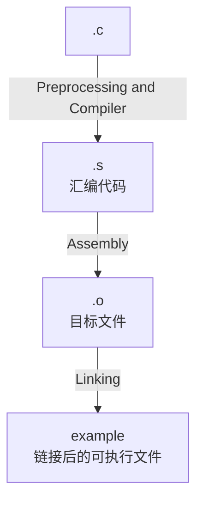

# Week 4

## compiler tool : gcc

### use gcc to compile a simple c program

Generally, we do like below:

```bash
gcc gccLearning.c -o example
./example 
Hello World
```

And we should know about the details:  

1. Preprocessing(预处理)  
    展开头文件，宏定义，条件编译等。
2. Compilation(编译)  
    `.c` -> `.s`  
3. Assembly(汇编)  
    `.s` -> `.o`  
4. Linking(链接)  
    `.o` -> `example`(for Linux or Unix-like) or `example.exe`(for Windows)  

Let's show it in detail:  

```bash
gcc -S gccLearning.c -o gccLearning.s
gcc -c gccLearning.s -o gccLearning.o
gcc gccLearning.o -o example
```

what's each command do?  



### disassemble the executable file

we use the tool : `objdump`  

`objdump -d example.o`  
`-d` : disassemble. 

```txt
objdump -d gccLearning.o

gccLearning.o:     file format elf64-x86-64


Disassembly of section .text:

0000000000000000 <main>:
   0:   55                      push   %rbp
   1:   48 89 e5                mov    %rsp,%rbp
   4:   48 8d 05 00 00 00 00    lea    0x0(%rip),%rax        # b <main+0xb>
   b:   48 89 c7                mov    %rax,%rdi
   e:   e8 00 00 00 00          call   13 <main+0x13>
  13:   b8 00 00 00 00          mov    $0x0,%eax
  18:   5d                      pop    %rbp
  19:   c3                      ret
```

addition, we can use `> txtFile` to save the output to a file
